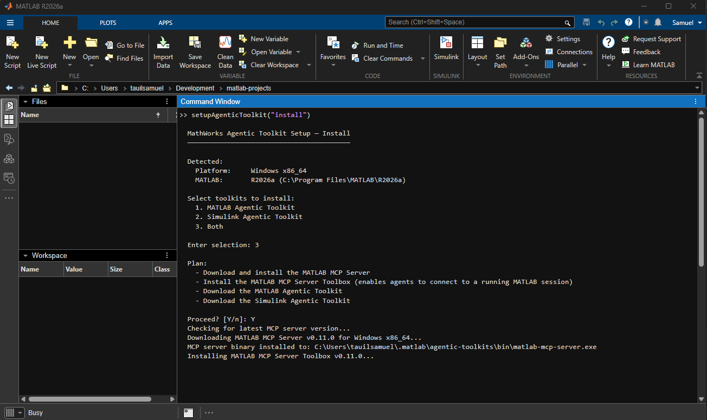
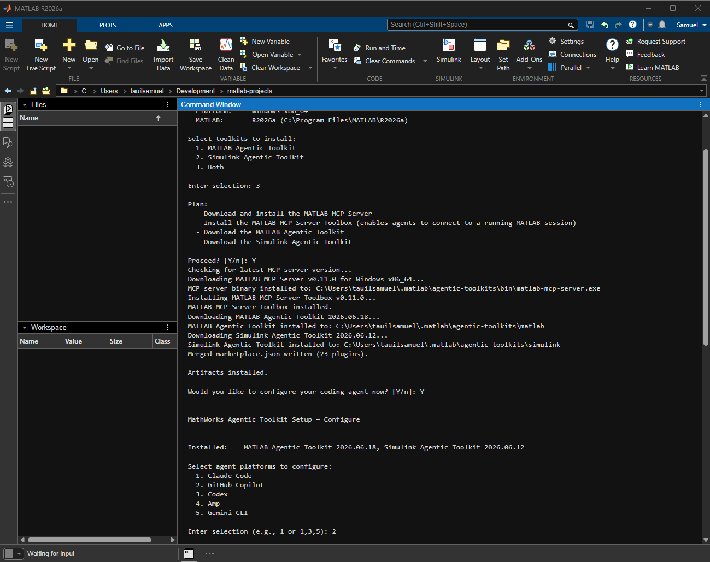
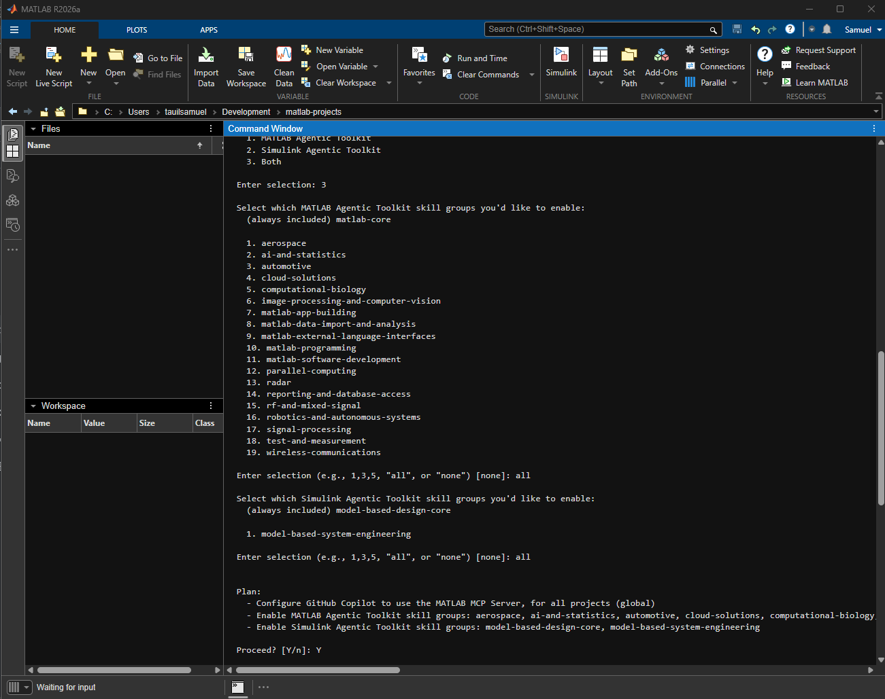
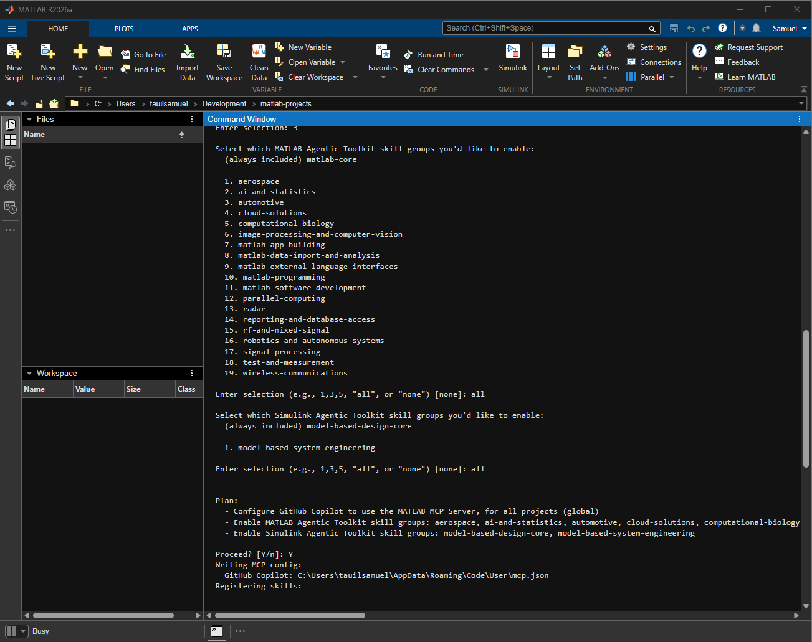

# Cardiac Digital Twin: GitHub Copilot + Simulink Agentic Toolkit demo

## Why this matters

A pharmaceutical company developing a cardiovascular drug today asks:
> *"How will the average patient respond?"*

Patients aren't average, though. They differ in age, weight, kidney function, genetics, existing conditions, and current medications. A single clinical trial against an "average" captures none of that variability, and failed trials can cost **billions of dollars and years of time**.

A **cardiac digital twin** changes the question to:
> *"How will **this type** of patient respond?"*

By simulating the cardiovascular system computationally, researchers can explore dosage effects across patient profiles **before enrolling a single person**. The result is fewer failed trials, shorter timelines, and lower cost for personalized medicine.

---

## What this demo shows

This demo makes that idea concrete. It uses **GitHub Copilot** orchestrating the **Simulink Agentic Toolkit** via MCP to simulate a beta-blocker dosage change on a cardiac digital twin, entirely through natural-language prompts, with no manual code editing.

**Detailed documentation:** the full reference is published at **<https://samueltauil.github.io/cardiac-digital-twin/>** — implementation details, formulas, architecture, validation methodology, and the Copilot workflow narrative.

---

## Demo scenario

> *"Simulate the effect of increasing a patient's beta-blocker (metoprolol) dosage by 20%."*

In eight Copilot prompts, the AI assistant will:
1. Describe the cardiac Simulink model architecture (PK, Hill HR, CO, BP, baroreflex)
2. Locate and resolve the `beta_blocker_dose_mg` parameter
3. Apply the +20 % change (50 mg to 60 mg)
4. Re-run the closed-loop simulation and compare the headline metrics
5. Interpret the physiological impact in clinical context
6. Generate a Gherkin verification test
7. Draft formal engineering requirements from the simulation results
8. Launch a real-time `uifigure` dashboard with overlaid run comparison

Three optional **deep-dive prompts** show Copilot doing structural analysis,
control-theory checks, and population statistics on the consolidated model:

9.  Explain the Hill/Emax receptor binding embedded in `HeartRateModel`
10. Linearize the closed loop and verify baroreflex stability margins
11. Run a 100-patient Monte Carlo cohort with a PRCC sensitivity tornado

See [`docs/advanced-physiology.md`](docs/advanced-physiology.md) for the
advanced-analysis narrative, and `demo/live_prompts.md` for the prompt text.

---

## Expected simulation results

| Metric | Baseline (50 mg) | Modified (60 mg) | Change |
|--------|:---:|:---:|:---:|
| Heart rate | 67.4 bpm | 66.6 bpm | -1.3 % |
| Cardiac output | 4.72 L/min | 4.66 L/min | -1.3 % |
| Mean arterial pressure | 84.9 mmHg | 83.9 mmHg | -1.3 % |

The marginal HR drop is small because the Hill curve saturates near Emax and the baroreflex partially restores HR.

---

## Repository structure

```
cardiac-digital-twin/
|-- context.md                      Use-case analysis and toolkit capability baseline
|-- README.md                       This file
|-- .github/
|   |-- copilot-instructions.md     Repo-wide always-on context for every Copilot interaction
|   |-- agents/
|   |   `-- cardiac-demo.agent.md   Custom Copilot agent for the cardiac demo workflow
|   |-- instructions/
|   |   `-- matlab.instructions.md  MATLAB-specific coding conventions (applied to *.m files)
|   `-- prompts/
|       |-- 01-explore-model.prompt.md
|       |-- 02-find-dosage-parameter.prompt.md
|       |-- 03-apply-dose-change.prompt.md
|       |-- 04-run-simulation.prompt.md
|       |-- 05-interpret-clinical-impact.prompt.md
|       |-- 06-generate-validation-test.prompt.md
|       |-- 07-generate-requirements.prompt.md
|       `-- 08-realtime-dashboard.prompt.md
|-- .vscode/
|   `-- mcp.json                    Workspace MCP server config (Windows template)
|-- mkdocs.yml                      MkDocs site configuration
|-- docs/                           MkDocs source (Material theme, MathJax, Mermaid)
|-- model/
|   |-- cardiac_params.m            Workspace parameters (PK, Hill/Emax, baroreflex, cohort distributions)
|   |-- create_cardiac_model.m      Builds CardiacDigitalTwin.slx programmatically
|   `-- run_simulation.m            Runs baseline + modified scenario, prints comparison
|-- analysis/                       Advanced-analysis scripts (population, control)
|   |-- run_patient_cohort.m        Monte Carlo cohort of 100 virtual patients (parsim)
|   |-- sensitivity_tornado.m       PRCC tornado plot of cohort parameter sensitivity
|   `-- linearize_baroreflex.m      Closed-loop linearization + Bode (Simulink Control Design)
|-- setup/
|   |-- startup.m                   MATLAB session initializer (run once per session)
|   |-- mcp-configuration.md        Full MCP setup guide (all platforms)
|   `-- preflight_checklist.md      Pre-demo verification checklist
|-- demo/
|   |-- live_prompts.md             8-step Copilot prompt sequence with timing and expected outputs
|   |-- scripted_runbook.md         Pre-verified fallback outputs for each step
|   |-- narrative_script.md         Executive narration track between prompts
|   `-- realtime_dashboard.m        Live uifigure dashboard (gauges + overlaid comparison)
|-- CardiacDigitalTwin_Requirements.slreqx  Formal engineering requirements artifact
`-- validation/
    |-- beta_blocker_dose_response.feature   Gherkin verification test
    |-- validation_criteria.md      10 pass/fail acceptance criteria with requirements traceability
    `-- validate_beta_blocker.m     Automated MATLAB validation suite
```

---

## Prerequisites

| Requirement | Notes |
|-------------|-------|
| MATLAB R2023a or later | Must include Simulink. |
| Simulink Test | Optional. Needed only for the `model_test` MCP tool. |
| Simulink Agentic Toolkit | Latest release from [matlab/simulink-agentic-toolkit](https://github.com/matlab/simulink-agentic-toolkit). |
| GitHub Copilot | VS Code with Agent mode and MCP enabled. |

---

## Quick start

### Step 1. Install and configure the Simulink Agentic Toolkit

Download `agenticToolkitInstaller.mltbx` from the [latest release](https://github.com/matlab/simulink-agentic-toolkit/releases/latest), install it in MATLAB, then run:

```matlab
setupAgenticToolkit("install")
```

When prompted, select **GitHub Copilot** as the target agent. This installs the MCP server binary, registers Simulink skills, and writes a global VS Code MCP configuration.

The install runs in four interactive stages.

1. Pick the toolkits to install (option `3` installs both MATLAB and Simulink agentic toolkits) and confirm the download plan.

    

2. Choose the agent platform to configure (`2` for GitHub Copilot).

    

3. Pick which MATLAB and Simulink skill groups to enable. `all` is a reasonable default for the demo.

    

4. The installer writes the MCP server entry into Copilot's user-level `mcp.json` and registers the selected skills.

    

See [`setup/mcp-configuration.md`](setup/mcp-configuration.md) for the full setup guide including manual configuration, macOS and Linux paths, and troubleshooting.

### Step 2. Configure the workspace MCP server

This repo ships `.vscode/mcp.json` pre-configured for Windows. After the automated install, no edits are needed on Windows. For macOS or Linux, replace the paths in `.vscode/mcp.json` with the platform-specific variants documented in [`setup/mcp-configuration.md`](setup/mcp-configuration.md).

> **Copilot CLI users:** The CLI stores MCP config in `~/.copilot/mcp-config.json`. Run `/mcp add` in interactive mode, or edit the file directly using the format in [`setup/mcp-configuration.md`](setup/mcp-configuration.md#copilot-cli).

Reload VS Code after any MCP configuration change: `Cmd/Ctrl+Shift+P`, then `Developer: Reload Window`.

### Step 3. Initialize MATLAB and build the model

Open MATLAB, navigate to this repo, and run the startup script:

```matlab
cd('<repo-root>')
run('setup/startup.m')
```

This loads workspace parameters, initializes the Simulink Agentic Toolkit (which shares the MATLAB session with the MCP server), and opens or builds `CardiacDigitalTwin.slx`.

After `startup.m` completes, **reload VS Code** so Copilot's MCP client attaches to the newly shared MATLAB session.

### Step 4. Verify the MCP connection

Ask Copilot in Agent mode:

```
Describe the structure of the currently open Simulink model.
```

Copilot should call `model_overview` and return a description of the `CardiacDigitalTwin` subsystem hierarchy. If it responds without calling MCP tools, see the troubleshooting section in [`setup/mcp-configuration.md`](setup/mcp-configuration.md).


### Step 5. Run the demo

Follow the files in `demo/` in order:

| File | Purpose |
|------|---------|
| `demo/live_prompts.md` | 8-prompt live Copilot walkthrough with expected outputs and timing. |
| `demo/scripted_runbook.md` | Pre-verified fallback outputs if live execution fails. |
| `demo/narrative_script.md` | Executive narration to speak between technical steps. |
| `demo/realtime_dashboard.m` | Live `uifigure` dashboard with overlaid run comparison (Prompt 8). |

Before every session, complete all checks in `setup/preflight_checklist.md`.

---

## Documentation site

The full implementation reference (model architecture, formulas, validation methodology, requirements artifact, real-time dashboard, and the Copilot prompt narrative) is published as a [Material for MkDocs](https://squidfunk.github.io/mkdocs-material/) site at:

**<https://samueltauil.github.io/cardiac-digital-twin/>**

The site rebuilds and redeploys automatically on every push to `main` that touches `docs/`, `mkdocs.yml`, or `docs-requirements.txt`, via the [`.github/workflows/docs.yml`](.github/workflows/docs.yml) GitHub Actions workflow. The MkDocs source lives under [`docs/`](docs/index.md); the built site is produced by CI and is not committed.

### Page map

| Page | Content |
|------|---------|
| [Home](https://samueltauil.github.io/cardiac-digital-twin/) | Vision, value, and what Copilot adds on top of the model. |
| [The Copilot workflow](https://samueltauil.github.io/cardiac-digital-twin/copilot-workflow.html) | Prompt-by-prompt narrative, the core of the demo. |
| [Model architecture](https://samueltauil.github.io/cardiac-digital-twin/architecture.html) | Subsystem topology, block-level internals, build-script rationale. |
| [Physiology and math](https://samueltauil.github.io/cardiac-digital-twin/physiology.html) | All formulas with derivations and clinical references. |
| [Validation](https://samueltauil.github.io/cardiac-digital-twin/validation.html) | The Gherkin test, the MATLAB suite, and when to use each. |
| [Requirements](https://samueltauil.github.io/cardiac-digital-twin/requirements.html) | EARS-pattern requirements, the link set, and `.slreqx` traceability. |
| [Real-time dashboard](https://samueltauil.github.io/cardiac-digital-twin/dashboard.html) | Pacing, `RuntimeObject` polling, and troubleshooting. |
| [Advanced physiology](https://samueltauil.github.io/cardiac-digital-twin/advanced-physiology.html) | Plain-language primer on Hill/Emax, the baroreflex, and the virtual patient cohort, plus closed-loop linearization and the PRCC tornado. |
| [Reference](https://samueltauil.github.io/cardiac-digital-twin/reference.html) | Parameters, MCP tools, and file map. |

> Editing the docs locally? Install the toolchain with `pip install -r docs-requirements.txt` and run `mkdocs serve` for a live preview at `http://127.0.0.1:8000`. Publishing is handled by CI — no manual `gh-deploy` step is needed.

---

## Demo flow summary

```
[Prompt 1] Describe model structure       -- model_overview, model_read
[Prompt 2] Find dosage parameter          -- model_query_params, model_resolve_params
[Prompt 3] Apply +20% dose change         -- model_edit / assignin
[Prompt 4] Run simulation and compare     -- sim, Simulink.SimulationInput
[Prompt 5] Explain physiological impact   -- Copilot reasoning + specifying-plant-models skill
[Prompt 6] Generate verification test     -- model_test (Gherkin)
[Prompt 7] Draft engineering requirements -- generate-requirement-drafts skill (slreq)
[Prompt 8] Real-time dashboard            -- realtime_dashboard.m (uifigure + pacing)

--- Optional deep dive ---
[Prompt 9]  Explain Hill/Emax receptor binding -- model_read of HeartRateModel/HillEquation
[Prompt 10] Closed-loop linearization          -- Simulink Control Design linearize + Bode
[Prompt 11] Virtual patient cohort + PRCC      -- parsim Monte Carlo + sensitivity tornado
```

---

## References

- [Simulink Agentic Toolkit](https://github.com/matlab/simulink-agentic-toolkit)
- [Simulink Agentic Toolkit, getting started guide](https://github.com/matlab/simulink-agentic-toolkit/blob/main/GETTING_STARTED.md)
- [MATLAB MCP Core Server](https://github.com/matlab/matlab-mcp-core-server)
- [MCP servers in VS Code](https://code.visualstudio.com/docs/copilot/customization/mcp-servers)
