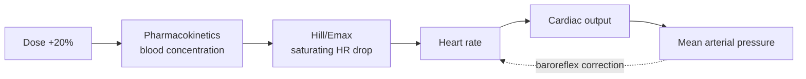

# Advanced physiology

The [Model architecture](architecture.md) page describes the headline cascade at a glance. This page goes deeper into the three features that make the cardiac digital twin physiologically realistic rather than a toy linear chain: **Hill/Emax receptor binding**, the **closed-loop baroreflex**, and a **virtual patient cohort** for population analysis.

All three are built into the single model, [`CardiacDigitalTwin.slx`](https://github.com/samueltauil/cardiac-digital-twin/blob/main/model/CardiacDigitalTwin.slx). The 8-prompt live demo exercises the headline dose-change scenario; the optional deep-dive prompts 9 through 11 explore the nonlinearity, the feedback loop, and the cohort in more detail.

---

## Concepts in plain language

If you are coming from the clinical side, a handful of engineering terms do most of the work on this page. Read these once and the rest follows.

| Term | Plain-language meaning | Where it lives in the model |
|---|---|---|
| **Receptor binding** | A drug works by latching onto specific receptors on cells. A beta-blocker binds the beta-1 receptors on the heart's pacemaker cells and tells them to slow down. There is a finite number of receptors, so once most are occupied, extra drug has nowhere left to bind. | `HeartRateModel` → `HillEquation` block |
| **Hill / Emax curve** | The S-shaped curve describing that saturating effect: small doses do little, mid doses do a lot, high doses add almost nothing. *Emax* is the most the drug can ever do; *EC50* is the concentration that gets you halfway there. | `HeartRateModel` |
| **Baroreflex** | The body's built-in blood-pressure thermostat. Pressure sensors (*baroreceptors*) in the neck and aorta constantly measure arterial pressure; if it falls, the brainstem speeds the heart back up to defend it. It is why a beta-blocker does not simply drag heart rate down without limit. | `BaroreflexController` |
| **Closed loop** | A system whose output is fed back into its own input. Here mean arterial pressure (an output) is routed back to heart rate (an input), so the model corrects itself the way a real body does. The opposite is an *open loop*, which runs forward and ignores the consequences. | `MAP → BaroreflexController → HR` feedback path |
| **Monte Carlo cohort** | Instead of simulating one "average" patient, randomly draw hundreds of plausible patients from realistic distributions and simulate them all. The *spread* of results, not just the average, is the answer. | [`analysis/run_patient_cohort.m`](https://github.com/samueltauil/cardiac-digital-twin/blob/main/analysis/run_patient_cohort.m) |
| **PRCC** | Partial Rank Correlation Coefficient — a score from −1 to +1 saying how strongly each patient parameter drives the outcome, with all the other parameters partialled out. Near ±1 = strong driver; near 0 = irrelevant. | [`analysis/sensitivity_tornado.m`](https://github.com/samueltauil/cardiac-digital-twin/blob/main/analysis/sensitivity_tornado.m) |
| **Sensitivity tornado** | A horizontal bar chart of those PRCC scores, sorted longest-to-shortest so it tapers like a funnel. The top bar is the parameter that matters most. | [`analysis/sensitivity_tornado.m`](https://github.com/samueltauil/cardiac-digital-twin/blob/main/analysis/sensitivity_tornado.m) |

### How the pieces fit together

The model is a **loop**, and each feature sits at a specific point on it. Follow one chain of cause and effect from dose to outcome:

1. A **dose** of metoprolol is absorbed — *pharmacokinetics* turns the daily milligrams into a blood concentration that rises and plateaus over time.
2. That concentration hits the **Hill/Emax** curve, which decides *how much* the heart slows. Because the curve saturates, going from 50 mg to 60 mg barely moves the needle — the central lesson of the demo.
3. A slower heart pumps less blood per minute, so **cardiac output** falls.
4. Less output means lower **mean arterial pressure** (MAP).
5. The **baroreflex** senses that pressure drop and nudges heart rate *back up* to defend perfusion — partially undoing step 2. This feedback is what *closes the loop*, and it is why the headline heart-rate change is even smaller than the Hill curve alone would predict.



That single loop is one nominal patient. The **virtual patient cohort** wraps the whole loop in a second, outer loop: re-run it a hundred times, each with a different randomly drawn patient, then use the **PRCC tornado** to ask *which patient trait — baseline heart rate? vascular resistance? receptor sensitivity? — decided the outcome.* The surprising answer (baseline heart rate dominates even the drug's own parameters) is exactly the kind of insight a population model exists to surface.

In demo terms: prompts 1–8 exercise that loop once for the 50 → 60 mg change; prompt 9 zooms into the **Hill/Emax** step, prompt 10 proves the **baroreflex** loop is stable, and prompt 11 runs the **cohort** and reads the **tornado**. The three sections below take each in turn.

---

## Why these three features matter

| Feature | Naive alternative | What the model does |
|---|---|---|
| Drug effect on HR | Linear gain: `effect = sensitivity * concentration` | Hill/Emax: `effect = Emax * C^n / (EC50^n + C^n)` |
| Cardiovascular loop | Open (feed-forward) | Closed via `BaroreflexController` (MAP feeds back into HR) |
| Patients simulated | One nominal patient per run | Monte Carlo cohort of 100 patients per dose, sampled from population distributions |
| Analysis surface | Steady-state table, time-history plots | Cohort summary, PRCC tornado plot, closed-loop linearization, Bode plot |
| Simulink toolboxes used | Simulink only | Simulink + Simulink Control Design + Parallel Computing Toolbox |

The model is built programmatically by [`model/create_cardiac_model.m`](https://github.com/samueltauil/cardiac-digital-twin/blob/main/model/create_cardiac_model.m) and uses parameters from [`model/cardiac_params.m`](https://github.com/samueltauil/cardiac-digital-twin/blob/main/model/cardiac_params.m).

---

## Feature 1 — Nonlinear receptor binding (Hill/Emax)

### Why this matters clinically

A linear drug effect means doubling the dose doubles the heart-rate drop. That is fine at low doses, but real receptor binding saturates. Once you have blocked most of the beta-1 receptors on the cardiac pacemaker cells, adding more drug stops adding effect. The clinically relevant phrase is *diminishing returns at higher doses*, and getting it wrong leads to overdosing without therapeutic benefit.

The standard pharmacological model for this is the Hill equation:

\[
\text{DrugEffect}(C) \;=\; E_{\max} \cdot \frac{C^n}{EC_{50}^n + C^n}
\]

with three parameters:

| Parameter | Meaning | Value |
|---|---|---:|
| \(E_{\max}\) | Maximum effect the drug can ever produce | 18 bpm |
| \(EC_{50}\) | Concentration that gives half-maximal effect | 35 mg |
| \(n\) | Hill coefficient (cooperativity) | 1.5 |

At low \(C\), the response is roughly linear in \(C^n / EC_{50}^n\). At \(C = EC_{50}\), the response is exactly \(E_{\max}/2\). As \(C \gg EC_{50}\), the response approaches \(E_{\max}\) and flattens.

### What the model does at 50 vs 60 mg

| Quantity | Linear gain (for contrast) | Hill + baroreflex (this model) |
|---|---:|---:|
| HR at 50 mg | 63.0 bpm | 67.4 bpm |
| HR at 60 mg | 60.6 bpm | 66.6 bpm |
| Marginal HR drop | −2.4 bpm | −0.9 bpm |
| Marginal as % | −3.8 % | −1.3 % |

The marginal drop is **less than half** what a linear gain would predict. This is exactly the saturation effect a clinician would want to see when deciding whether to push a dose higher.

### What Copilot does in Prompt 9

Copilot reads the `HeartRateModel` subsystem, identifies the `HillEquation` Fcn block, explains the equation and its clinical parameters, and plots the dose-response curve. The relevant MCP tools are `model_read`, `model_resolve_params`, and `evaluate_matlab_code`.

---

## Feature 2 — Baroreflex feedback loop

### Why this matters clinically

The cardiovascular system is a closed loop in real bodies. When MAP drops, baroreceptors in the carotid sinus and aortic arch fire less, the brainstem withdraws parasympathetic tone and adds sympathetic tone, and HR rises. That is the *baroreflex*, and it is the reason real patients on a beta-blocker do not collapse the moment the drug starts working.

An open-loop model ignores this. The `BaroreflexController` subsystem closes the loop:

\[
\text{HR}_\text{correction}(s) \;=\; \frac{K_\text{baro}}{\tau_\text{baro}\, s + 1}\, (\text{MAP}_\text{setpoint} - \text{MAP})
\]

with \(K_\text{baro} = 0.30\) bpm/mmHg, \(\tau_\text{baro} = 60\) s, setpoint 94 mmHg. The correction is added back into `HeartRateModel` as a second input.

### Stability and the linearization

The closed loop must be stable. [`analysis/linearize_baroreflex.m`](https://github.com/samueltauil/cardiac-digital-twin/blob/main/analysis/linearize_baroreflex.m) uses Simulink Control Design's `linearize` at a steady-state operating point (snapshotted at \(t = 3600\) s so the Hill expression evaluates at a meaningful concentration) for both the open and closed loops:

| Metric | Open loop | Closed loop |
|---|---:|---:|
| DC gain (bpm per mg of dose) | −0.152 | −0.111 |
| Poles | −0.0006 | −0.0230, −0.0006 |
| Stable | yes | yes |

Two takeaways:

1. The baroreflex reduces the dose-to-HR DC gain by about 27%. The drug becomes effectively weaker because the autonomic system fights back.
2. The closed loop adds a fast stable pole at −0.023 rad/s without destabilising the slow PK pole. No stability margin is at risk.

The script also produces a Bode plot comparing open and closed loops; the closed-loop magnitude rolls off earlier, which matches the slower HR response observed in the time-domain simulations.

### What Copilot does in Prompt 10

Copilot runs the linearization at the 60 mg steady-state operating point with the baroreflex active and again with the gain set to zero, then reports the poles, DC-gain difference, and bandwidth shift with a comparative Bode plot. The relevant MCP tool is `evaluate_matlab_code` driving the Simulink Control Design workflow.

---

## Feature 3 — Virtual patient cohort

### Why this matters clinically

A nominal patient is a useful starting point but a poor representation of a clinical population. Two patients with the same dose and the same baseline HR can land 15 bpm apart at steady state because their PK clearance, receptor density, baseline SVR, and stroke volume are all different. Monte Carlo over these parameters gives a population-level view of dose response, the kind of analysis a phase-2 trial would expect.

[`analysis/run_patient_cohort.m`](https://github.com/samueltauil/cardiac-digital-twin/blob/main/analysis/run_patient_cohort.m) samples 100 virtual patients per dose:

| Parameter | Distribution | CV / sigma |
|---|---|---|
| `pk_time_constant`     | log-normal around nominal | sigma 0.25 |
| `emax_bpm`             | log-normal around nominal | sigma 0.25 |
| `ec50_mg`              | log-normal around nominal | sigma 0.25 |
| `hill_n`               | normal, floored at 0.5     | CV 0.15 |
| `baseline_heart_rate`  | normal, floored at 50      | CV 0.15 |
| `stroke_volume_mL`     | normal                     | CV 0.15 |
| `svr_mmHg_min_per_L`   | normal                     | CV 0.15 |

The script builds a `Simulink.SimulationInput` per patient per dose (200 runs), uses `parsim` when Parallel Computing Toolbox is available and falls back to `arrayfun(@sim, ...)` otherwise.

### Cohort summary at 50 vs 60 mg

| Dose | HR (bpm, mean ± sd) | CO (L/min, mean ± sd) | MAP (mmHg, mean ± sd) |
|---|---|---|---|
| 50 mg | 67.5 ± 9.1 | 4.80 ± 0.72 | 85.3 ± 18.6 |
| 60 mg | 66.7 ± 9.1 | 4.74 ± 0.72 | 84.3 ± 18.5 |

The mean dose effect is small (about 1 bpm) but the standard deviation is large (about 9 bpm). For roughly 25 of the 100 simulated patients, the dose increase moves HR by *less* than the nominal effect; for others it moves it by twice as much. That spread is the clinically interesting story.

### Sensitivity tornado (PRCC)

[`analysis/sensitivity_tornado.m`](https://github.com/samueltauil/cardiac-digital-twin/blob/main/analysis/sensitivity_tornado.m) computes the partial rank correlation coefficient (PRCC) between each sampled parameter and the cohort HR response at 60 mg. PRCC is the standard global sensitivity metric for Monte Carlo population pharmacology because it is rank-based (robust to nonlinearity) and partials out the other inputs.

| Parameter | PRCC vs HR at 60 mg |
|---|---:|
| Baseline HR     | +0.96 |
| SVR             | −0.77 |
| Stroke volume   | −0.67 |
| Emax            | −0.62 |
| EC50            | +0.29 |
| PK time constant| +0.19 |
| Hill n          | −0.11 |

Two readings:

1. **Baseline HR dominates.** The single biggest driver of where a patient ends up is where they started. Drug pharmacology comes second.
2. **Negative SVR correlation.** Patients with higher peripheral resistance have lower HR at steady state, because the baroreflex senses the higher MAP and pulls HR down. The closed loop makes this visible; an open-loop model would have shown a near-zero correlation here.

The tornado plot orders these by `|PRCC|` and colours positive vs negative correlations.

### What Copilot does in Prompt 11

Copilot runs the `parsim` cohort wrapper and the PRCC tornado script. The relevant MCP tools are `evaluate_matlab_code` to execute the cohort and `check_matlab_code` to validate the scripts before running.

---

## What this proves about the toolchain

The model is a closed-loop nonlinear population-pharmacology workbench, and every advanced analysis on it is a Copilot prompt that uses the MCP tools as primitives:

| Capability | MCP surface |
|---|---|
| Read and explain a nonlinear block | `model_read`, `model_resolve_params` |
| Inspect the feedback loop topology | `model_read`, `model_overview` |
| Linearize at a custom operating point | `evaluate_matlab_code` (Simulink Control Design) |
| Build and run a Monte Carlo cohort | `evaluate_matlab_code` (parsim) |
| Validate generated scripts before running | `check_matlab_code` |

The same prompt-driven workflow that handles the headline dose-change scenario scales to closed-loop linearization and a population cohort. That is the point worth making at the end of the demo.

---

## Running it yourself

```matlab
% Build the model (one-time)
run('model/cardiac_params.m');
run('model/create_cardiac_model.m');

% Single-patient nominal comparison (quick smoke test)
run('model/run_simulation.m');

% Closed-loop linearization (Prompt 10)
run('analysis/linearize_baroreflex.m');

% Monte Carlo cohort + sensitivity (Prompt 11)
run('analysis/run_patient_cohort.m');
run('analysis/sensitivity_tornado.m');
```

Total wall-clock for a fresh run on a workstation without Parallel Computing Toolbox is about 3 to 4 minutes, dominated by the 200 cohort simulations.
