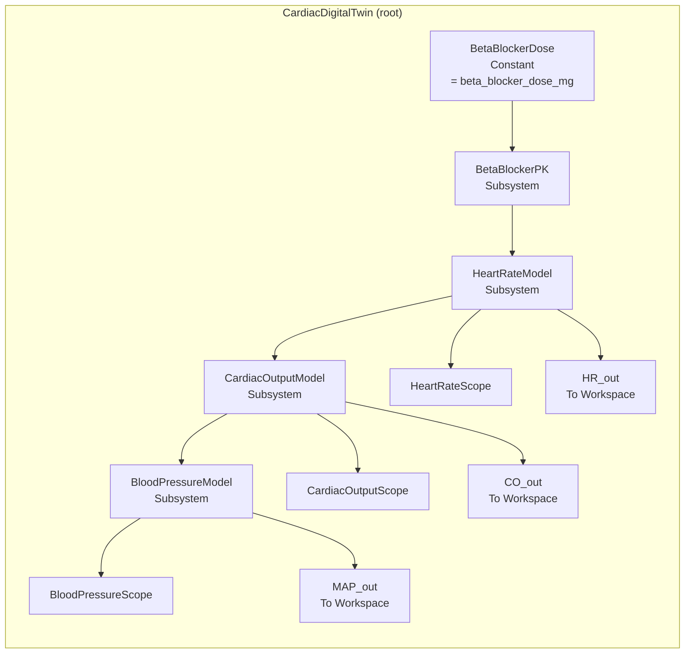
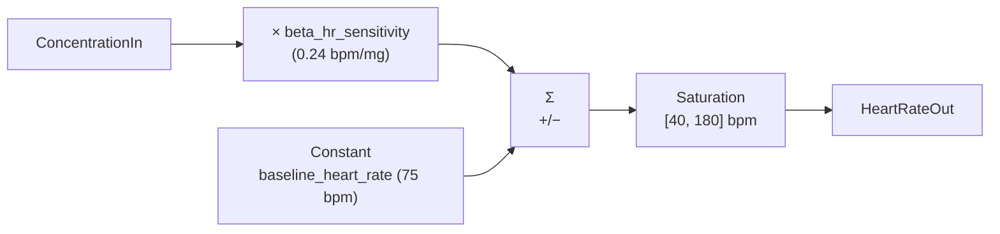
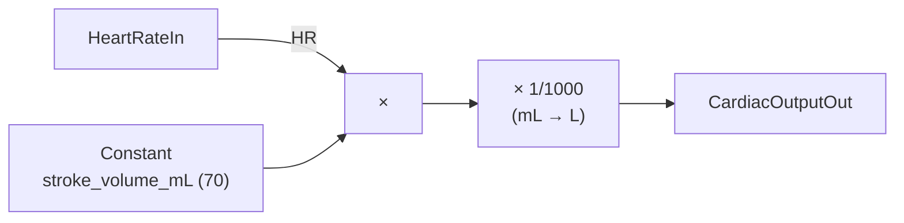
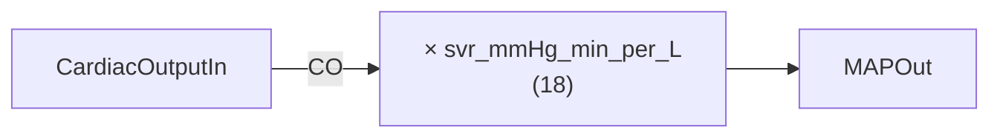

# Model architecture

`CardiacDigitalTwin.slx` is built programmatically from [`model/create_cardiac_model.m`](https://github.com/samueltauil/cardiac-digital-twin/blob/main/model/create_cardiac_model.m). That script, not the binary `.slx`, is the source of truth in this repo.

## High-level topology



Four behavioural subsystems in a strict cascade, three scopes for live viewing, and three `To Workspace` blocks for programmatic validation. There are no feedback paths. The model is a feed-forward pipeline from dose to mean arterial pressure.

| Block ID | Block | Interface |
|---|---|---|
| blk_1 | `BetaBlockerDose` (Constant) | out: scalar dose |
| blk_2 | `BetaBlockerPK` | in: `DoseIn`. out: `ConcentrationOut` |
| blk_3 | `HeartRateModel` | in: `ConcentrationIn`. out: `HeartRateOut` |
| blk_4 | `CardiacOutputModel` | in: `HeartRateIn`. out: `CardiacOutputOut` |
| blk_5 | `BloodPressureModel` | in: `CardiacOutputIn`. out: `MAPOut` |

---

## Subsystem details

### BetaBlockerPK. First-order pharmacokinetics


Single block: a continuous transfer function.

```
PKTransferFcn:
  Numerator   = [1]
  Denominator = [pk_time_constant 1]   % = [1800  1]
```

A first-order absorption and elimination model is the simplest PK structure that captures the *time course* of an oral beta-blocker after steady dosing. It produces a smooth exponential approach to a plateau equal to the dose.

The unity DC gain is deliberate. At steady state the plasma concentration *equals* the dose value. This keeps the downstream chain numerically intuitive: at 50 mg dose, the input to HeartRateModel is 50; at 60 mg dose, the input is 60.

The 30-minute time constant (\(\tau = 1800\) s) was chosen for the demo. It is fast enough for the simulation to settle within the window, slow enough that the pharmacokinetic dynamics are visible on the scopes. Metoprolol's clinical half-life is 3 to 7 hours; the shorter value here keeps simulation time short while preserving the exponential shape of the response.

### HeartRateModel. Chronotropic response



Five blocks: Constant, Gain, Sum (`+−`), Saturation, plus the I/O Inport and Outport.

\[
\text{HR}(t) = \mathrm{clamp}\!\left(\text{HR}_0 - k_\beta \cdot C(t),\ 40,\ 180\right)
\]

Beta-blocker chronotropic response is roughly linear in the therapeutic dose range. A receptor-binding model would be more accurate but obscure the relationship between dose and outcome, which is the property this demo is built to show.

The saturation block sets physiological floor and ceiling values. It is a defensive guard that never activates in the normal dose range (the lower clamp engages only at dose \(\ge\) 145 mg) but bounds the model's output domain.

### CardiacOutputModel. Fick-like product



\[
\text{CO}\ [\text{L/min}] = \text{HR}\ [\text{bpm}] \times \frac{\text{SV}\ [\text{mL}]}{1000}
\]

A textbook decomposition: cardiac output equals beats per minute times volume per beat. The `× 1/1000` is a unit conversion from mL to L.

Beta-blockers' impact on stroke volume is small (and mixed in direction; they can slightly *increase* SV by lengthening diastolic filling time, while slightly *decreasing* contractility). At the level of linearity this demo aims for, treating SV as a fixed parameter gives an honest first-order picture. A Frank-Starling loop tying SV to preload would be the natural extension, but it is out of scope here.

### BloodPressureModel. Afterload coupling



\[
\text{MAP}\ [\text{mmHg}] = \text{CO}\ [\text{L/min}] \cdot \text{SVR}\ [\text{mmHg}\cdot\text{min/L}]
\]

A direct application of the haemodynamic identity \(\text{MAP} = \text{CO} \cdot \text{SVR}\), with SVR held constant. Beta-blockers have minimal direct vasoactive effect at this dose; their MAP reduction is mediated through CO.

---

## Why this structure (and not something else)

| Alternative | Why it was *not* chosen for this demo |
|---|---|
| Receptor-binding PD model (Hill or Emax) | Adds curve-fitting complexity and parameter ambiguity. The linear gain is good to within \(\pm 5\) % in the therapeutic dose range and stays auditable. |
| Two-compartment PK | Captures distribution kinetics that aren't needed for a steady-state dose-change question. The one-compartment model gives the same steady state and the right transient *shape*. |
| Closed-loop baroreflex | Would feed MAP back into HR. Realistic, but doubles model complexity and obscures the linear traceability the demo is built around. |
| Stateflow control logic | Belongs in a closed-loop controller demo, not a plant model. |

The model is *deliberately* a pedagogical plant. Every parameter has units, a clinical reference, and a single role in one formula. That is what makes the Copilot workflow legible: every prompt about a parameter or a signal has an unambiguous answer.

---

## How the model is built

The `.slx` file is gitignored. Whoever clones this repo regenerates it from the source script:

```matlab
run('model/create_cardiac_model.m')
```

That script does the following.

1. Creates a fresh `CardiacDigitalTwin` system.
2. Configures the solver (`ode45`, variable-step, `StopTime = 3600`).
3. Adds the dose Constant block bound to `beta_blocker_dose_mg`.
4. Adds each subsystem with named Inport and Outport blocks.
5. Wires the internals of every subsystem.
6. Adds Scopes and `To Workspace` blocks at the root.
7. Saves the resulting `CardiacDigitalTwin.slx`.

The source of truth for a Simulink model is far more reviewable when it is a script than when it is a binary `.slx`. Diffs become readable; merges become tractable; the model's structure is documented *by being the script that builds it.*

This is also the pattern that makes Copilot most useful. When the model is buildable from text, Copilot can reason about, edit, and regenerate it without ever needing to manipulate the binary directly.

---

## Top-level outputs

The three scopes are for live viewing during simulation; the three `To Workspace` blocks are for analysis after the run completes. They are stored in `SaveFormat = 'Array'`, which gives a plain column vector. Time is recovered from the `tout` companion variable.

| Variable | Source block | Shape after a 9000 s run |
|---|---|---|
| `tout` | `tout` (model logging) | N x 1 (variable-step solver decides N) |
| `HR_out` | `HeartRateModel → HR_out` | N x 1 bpm |
| `CO_out` | `CardiacOutputModel → CO_out` | N x 1 L/min |
| `MAP_out` | `BloodPressureModel → MAP_out` | N x 1 mmHg |

This is the format the real-time dashboard reads and the Gherkin tests inspect. It is also exactly what a future test-vector library would store, so the same plumbing supports both interactive exploration and automated verification.
