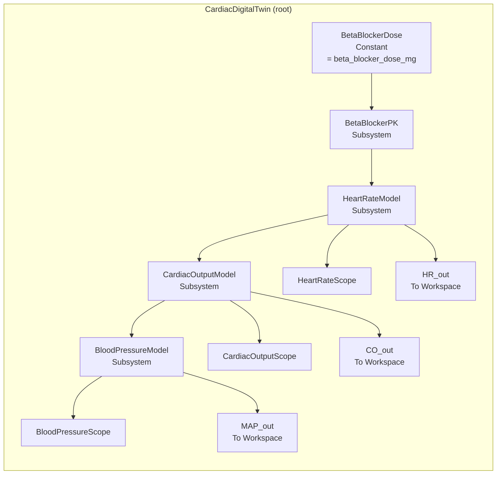
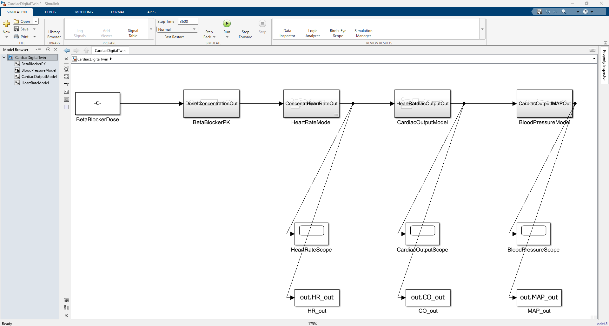
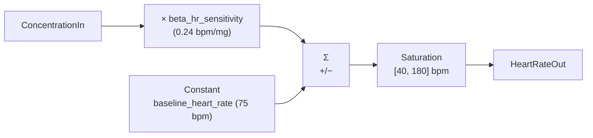
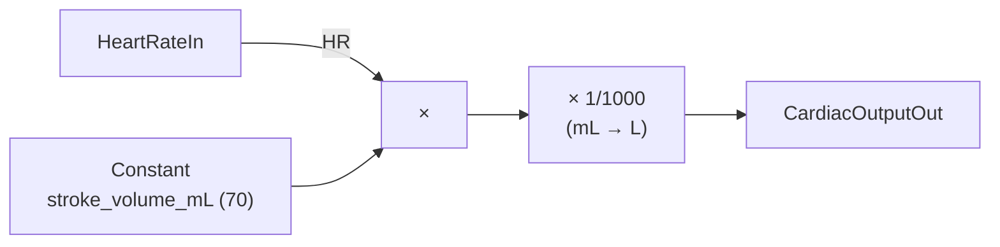
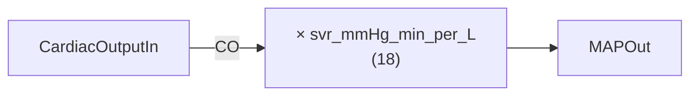

# Model architecture

!!! info "Before you read"
    This page describes a [Simulink](https://www.mathworks.com/products/simulink.html) model.
    Simulink is a visual programming environment from MathWorks where you connect
    **blocks** (small functional elements) with **signals** (the lines between them)
    to build executable mathematical models. If you have never used Simulink, the
    [Simulink vocabulary](#a-short-simulink-vocabulary) section below covers
    everything you need to follow the page.

`CardiacDigitalTwin.slx` is built programmatically from [`model/create_cardiac_model.m`](https://github.com/samueltauil/cardiac-digital-twin/blob/main/model/create_cardiac_model.m). That script, not the binary `.slx`, is the source of truth in this repo.

---

## A short Simulink vocabulary

| Term | What it is |
|---|---|
| **Block** | A graphical element that performs one function (a constant value, a multiplication, a filter, a plot). |
| **Signal** (or wire) | The line connecting one block's output to another block's input. It carries a numerical value over time. |
| **Subsystem** | A group of blocks treated as one. Has its own inputs and outputs, like a function in code. |
| **Inport / Outport** | The "doors" of a subsystem: the named input and output ports through which signals enter and leave. |
| **Constant** block | Outputs a fixed value forever. We use it to inject the dose. |
| **Gain** block | Multiplies the input by a fixed number. We use it for the chronotropic gain and the unit conversion. |
| **Sum** block | Adds or subtracts inputs (a `+−` Sum subtracts the second input from the first). |
| **Saturation** block | Clips the input to a min/max range. We use it as a physiological safety floor on heart rate. |
| **Transfer Fcn** block | A continuous-time filter expressed in [Laplace transform](https://en.wikipedia.org/wiki/Laplace_transform) notation `N(s)/D(s)`. Used here for the first-order pharmacokinetics. |
| **Scope** block | A graphical viewer that plots a signal versus time. Three of them show HR, CO, and MAP during simulation. |
| **To Workspace** block | Writes a signal's time history to a MATLAB variable for later analysis. We use them to feed the dashboard and the validation tests. |
| **Solver** | The numerical algorithm that integrates the model equations over time. This model uses `ode45`, a standard Runge-Kutta method for smooth nonlinear systems. |
| **Cascade** | Several subsystems chained so each one's output feeds the next one's input, with no loops back. Also called *feed-forward*. |

---

## High-level topology



Four behavioural subsystems in a strict cascade. Three Scope blocks for watching the signals during simulation, and three `To Workspace` blocks for analysing them after the run. The model has no feedback paths: data only flows left to right, from drug dose to mean arterial pressure (the average blood pressure that drives blood through the body).



| Block ID | Block | Interface |
|---|---|---|
| blk_1 | `BetaBlockerDose` (Constant) | out: scalar dose value in mg |
| blk_2 | `BetaBlockerPK` | in: `DoseIn` (mg). out: `ConcentrationOut` (plasma drug level) |
| blk_3 | `HeartRateModel` | in: `ConcentrationIn`. out: `HeartRateOut` (bpm) |
| blk_4 | `CardiacOutputModel` | in: `HeartRateIn`. out: `CardiacOutputOut` (L/min) |
| blk_5 | `BloodPressureModel` | in: `CardiacOutputIn`. out: `MAPOut` (mmHg) |

!!! note "What `blk_N` means"
    Every block in Simulink has a stable internal ID like `blk_2`. The MCP tools
    Copilot uses (`model_read`, `model_edit`, `model_query_params`) refer to
    blocks by these IDs, which is why they show up in the documentation. You
    can ignore them if you only care about the named blocks.

---

## Subsystem details

### BetaBlockerPK: first-order pharmacokinetics


This subsystem models **pharmacokinetics** (PK): how the concentration of a drug in the blood changes over time after you take it. The single block inside is a continuous-time transfer function, the Simulink way to write a linear differential equation:

```
PKTransferFcn:
  Numerator   = [1]
  Denominator = [pk_time_constant 1]   % = [1800  1]
```

In plain words, after you take the metoprolol tablet, the level of the drug in your blood (the **plasma concentration**) rises smoothly toward a plateau equal to the dose. It does not jump there instantly. It approaches the plateau on an exponential curve.

A few engineering details that matter for the demo.

The **DC gain** (the ratio between input and output once everything has settled) is one. At steady state the plasma concentration *equals* the dose value. This is what lets the validation test drive the `HeartRateModel` subsystem directly with `const(50)` and `const(60)` and still represent the full-model comparison.

The **time constant** \(\tau = 1800\) s, equivalent to 30 minutes. The time constant tells you how fast the system responds. After one \(\tau\), the response has reached about 63 % of its final value. After 5\(\tau\) (9000 s, 2.5 hours), it is within 0.7 % of the final value. The simulation's default `StopTime` of 3600 s catches roughly 86 % of the asymptote (2 time constants); the full-validation runs extend to 9000 s.

The **half-life** is \(\tau \ln 2\), about 21 minutes. Metoprolol's clinical half-life is actually 3 to 7 hours. The demo uses 30 minutes so the simulation does not take all day, while preserving the exponential *shape* of the response.

### HeartRateModel: chronotropic response



Five blocks: Constant, Gain, Sum (`+−`), Saturation, plus the Inport and Outport that connect the subsystem to its neighbours.

\[
\text{HR}(t) = \mathrm{clamp}\!\left(\text{HR}_0 - k_\beta \cdot C(t),\ 40,\ 180\right)
\]

The clinical term **chronotropic** means "affecting heart rate". Beta-blockers reduce heart rate by occupying receptors on the heart muscle that would otherwise be stimulated by adrenaline. In the therapeutic dose range this effect is roughly linear: each additional milligram of dose lowers the resting heart rate by a small, predictable amount. A receptor-binding model would be more accurate but would obscure the cause-and-effect relationship that this demo is built to show.

The Saturation block sets a physiological floor and ceiling on the heart rate. It is a defensive guard, not an active part of normal operation: at the standard doses the clamp never engages. The lower clamp only activates if the dose exceeds 145 mg, which is outside the therapeutic range entirely.

### CardiacOutputModel: a Fick-like product



\[
\text{CO}\ [\text{L/min}] = \text{HR}\ [\text{bpm}] \times \frac{\text{SV}\ [\text{mL}]}{1000}
\]

**Cardiac output** (CO) is the total volume of blood the heart pumps per minute. It is a direct multiplication: how many heartbeats per minute, times how much blood per heartbeat. The `× 1/1000` is a unit conversion from millilitres to litres.

**Stroke volume** (SV) is the amount of blood ejected with each beat (about 70 mL at rest for a typical adult). Beta-blockers' impact on stroke volume is small and goes in two directions at once: a slower heart has more time to fill (which slightly increases SV) but also contracts a little less forcefully (which slightly decreases SV). For a first-order picture, treating SV as a fixed parameter is honest. A more complex model would tie SV to the **Frank-Starling relationship**, where SV depends on how much blood enters the heart before each beat.

### BloodPressureModel: afterload coupling



\[
\text{MAP}\ [\text{mmHg}] = \text{CO}\ [\text{L/min}] \cdot \text{SVR}\ [\text{mmHg}\cdot\text{min/L}]
\]

A direct application of the haemodynamic identity that ties mean blood pressure to flow and resistance. **MAP** (mean arterial pressure) is the time-averaged pressure in the arteries. **SVR** (systemic vascular resistance) is how much the body's blood vessels resist that flow, sometimes called the **afterload** because it is the load the heart has to pump *against*.

SVR is held constant in this model. Beta-blockers have very little direct effect on blood vessels at this dose; the pressure drop they produce comes almost entirely from the cardiac output drop, not from vessel dilation.

---

## Why this structure (and not something else)

The v1 model is intentionally pedagogical. The three biggest physiological gaps below are each addressed in the v2 model, documented in [Advanced physiology (Phase 2)](advanced-physiology.md):

| Alternative considered for v1 | Why it was *not* chosen for v1 | v2 status |
|---|---|---|
| Receptor-binding PD model (a Hill or Emax curve, where the dose-response saturates at high doses) | Adds curve-fitting complexity and parameter ambiguity. The linear gain is good to within \(\pm 5\) % in the therapeutic dose range and stays auditable. | Implemented (Prompt 9) |
| Closed-loop baroreflex (the body's automatic blood-pressure feedback that nudges HR and SVR when MAP changes) | More realistic, but doubles the model complexity and obscures the linear traceability the demo is built around. | Implemented (Prompt 10) |
| Two-compartment PK (drug distributes into a peripheral tissue compartment as well as the blood) | Captures distribution kinetics that are not needed for a steady-state dose-change question. The one-compartment model gives the same steady state and the right transient *shape*. | Not implemented |
| Stateflow control logic | Belongs in a closed-loop controller demo, not a plant model. | Not implemented |

v1 is *deliberately* a pedagogical plant: every parameter has units, a clinical reference, and a single role in one formula. That is what makes the Copilot workflow legible for the live demo. v2 keeps that traceability while adding the nonlinearity, feedback, and population variability needed for a more realistic pharmacological workbench.

---

## How the model is built

The `.slx` file is gitignored. Whoever clones this repo regenerates it from the source script:

```matlab
run('model/create_cardiac_model.m')
```

That script does the following.

1. Creates a fresh `CardiacDigitalTwin` system.
2. Configures the solver (`ode45`, variable-step, `StopTime = 3600`). The solver is the numerical algorithm that integrates the model equations forward in time; variable-step means it picks its own time step to maintain accuracy.
3. Adds the dose Constant block bound to `beta_blocker_dose_mg` (a workspace variable, so it can be changed from MATLAB without editing the model).
4. Adds each subsystem with named Inport and Outport blocks.
5. Wires the internals of every subsystem.
6. Adds Scope and `To Workspace` blocks at the root.
7. Saves the resulting `CardiacDigitalTwin.slx`.

The source of truth for a Simulink model is far more reviewable when it is a script than when it is a binary `.slx`. Diffs become readable. Merges become tractable. The model's structure is documented *by being the script that builds it*. This is also the pattern that makes Copilot most useful: when the model is buildable from text, Copilot can reason about, edit, and regenerate it without ever needing to manipulate the binary directly.

---

## Top-level outputs

The three Scopes are for live viewing during simulation. The three `To Workspace` blocks are for analysis after the run completes. They are stored in `SaveFormat = 'Array'`, which gives a plain column vector of values. Time is recovered from the `tout` companion variable that Simulink automatically populates.

| Variable | Source block | Shape after a 9000 s run |
|---|---|---|
| `tout` | `tout` (model logging) | N × 1 (the variable-step solver decides N) |
| `HR_out` | `HeartRateModel → HR_out` | N × 1 bpm |
| `CO_out` | `CardiacOutputModel → CO_out` | N × 1 L/min |
| `MAP_out` | `BloodPressureModel → MAP_out` | N × 1 mmHg |

This is the format the real-time dashboard reads and the validation tests inspect. The same plumbing supports both interactive exploration and automated verification.

*[HR]: heart rate, measured in beats per minute (bpm)
*[CO]: cardiac output, the volume of blood the heart pumps per minute (L/min)
*[SV]: stroke volume, the volume of blood ejected per heartbeat (mL/beat)
*[MAP]: mean arterial pressure, the time-averaged arterial blood pressure (mmHg)
*[SVR]: systemic vascular resistance, how much the body's blood vessels resist blood flow (mmHg·min/L)
*[PK]: pharmacokinetics, how the body absorbs, distributes, and eliminates a drug over time
*[PD]: pharmacodynamics, how a drug affects the body once it is there
*[bpm]: beats per minute
*[mmHg]: millimetres of mercury, the standard unit for blood pressure
*[mg]: milligram
*[mL]: millilitre
*[L]: litre
*[ode45]: a Runge-Kutta variable-step solver, the Simulink default for smooth nonlinear systems
