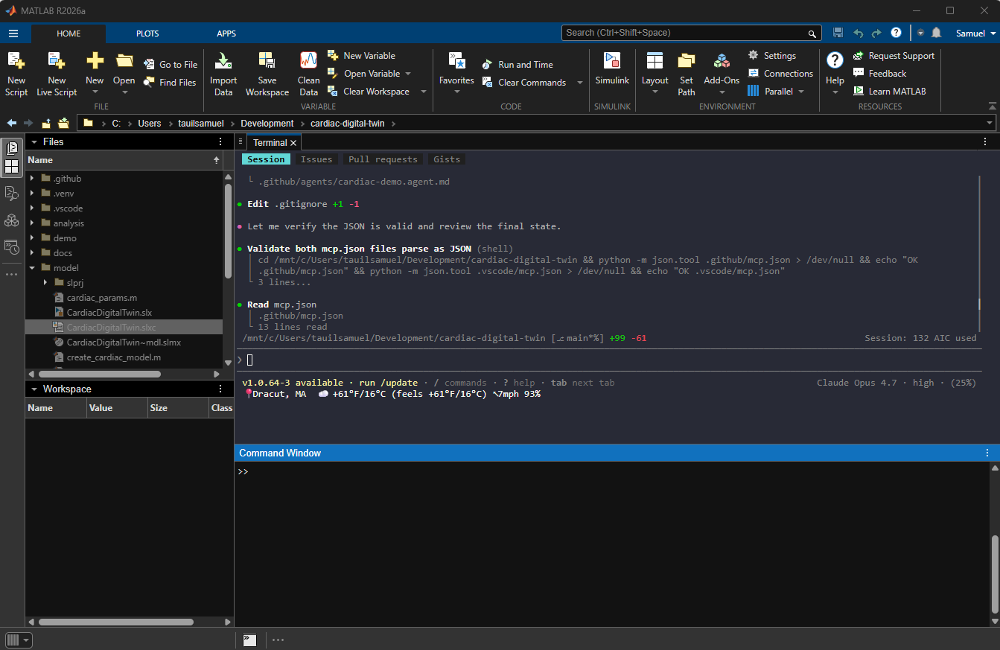
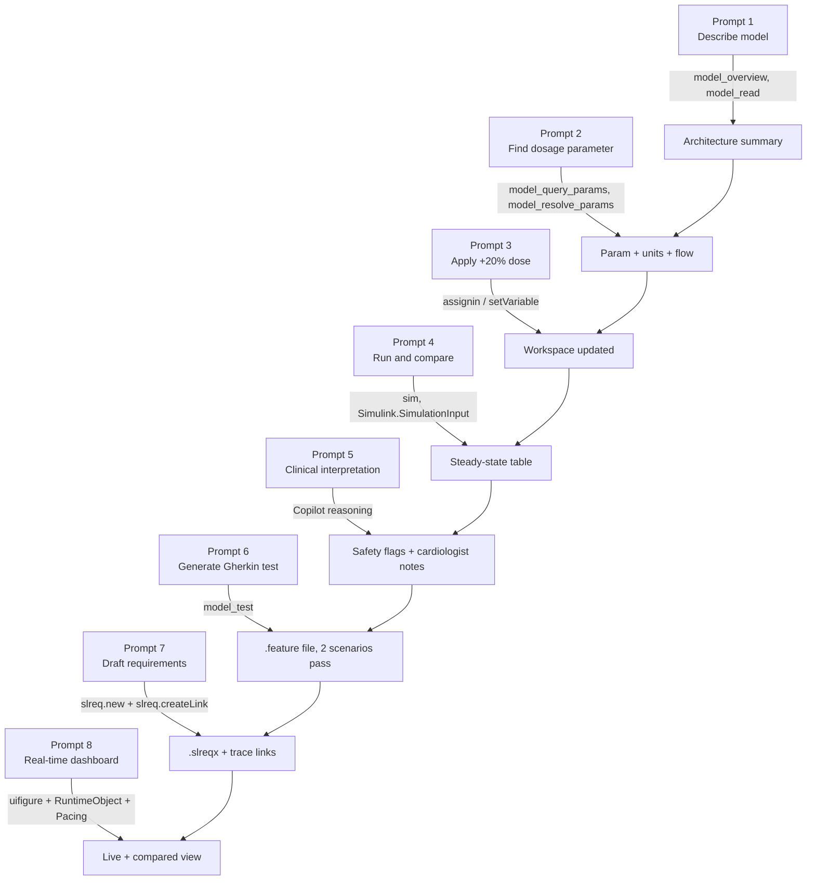
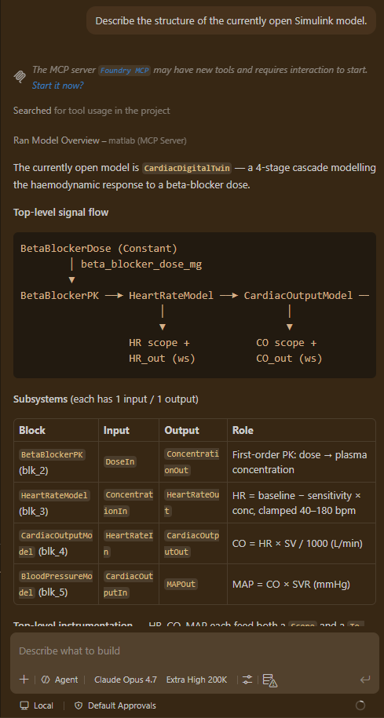

# The Copilot workflow

The centre of gravity of this demo isn't the model. It's the **prompt sequence that turns a clinical question into a verified engineering artifact**, all in natural language, all driven by GitHub Copilot in Agent mode, with the Simulink Agentic Toolkit's MCP server providing the bridge into a live MATLAB session.

This page walks through what each prompt does, which MCP tool answers it, and why that combination matters.

The agent can drive the workflow from either Copilot surface. Here the **GitHub Copilot CLI** runs inside MATLAB's integrated terminal, operating on the live `CardiacDigitalTwin` project from the repo root — validating the repo-level `mcp.json` files in the same session that hosts the model.



---

## The full eight-prompt sequence



---

## What makes this different from "AI writing code"

Most AI-coding demos generate isolated snippets in a vacuum. This one is structurally different.

First, the AI reads a live engineering artifact. Through the MCP server, every tool call inspects the actual `CardiacDigitalTwin.slx` open in MATLAB. There is no simulation of what the model *might* be. Copilot sees the real block topology, real parameter values, and real signal connections.

Second, the AI writes back to the same artifact. Edits, test runs, requirement sets, and traceability links are all created against the live model, not in a fork or copy. The model file you commit is the artifact Copilot modified.

Third, every step produces a durable engineering deliverable. Architecture summary, validation test, requirements set: each turn leaves something reviewable behind. The prompt log is the audit trail.

---

## Prompt 1. Explore the model

> *"I have a cardiac digital twin model open in Simulink called CardiacDigitalTwin. Give me an overview of the model structure: what are the main subsystems, what does each one represent, and how do they connect to each other?"*

**MCP tools called:** `model_overview`, `model_read`.

**What Copilot returns:** the five-subsystem closed-loop model (BetaBlockerPK, HeartRateModel, CardiacOutputModel, BloodPressureModel, and the BaroreflexController that feeds MAP back into heart rate), described in terms of the physiological mechanism each one implements. Subsystem-by-subsystem input and output names are listed alongside the role each plays in the dose-to-MAP chain and the autonomic feedback loop.

**Why it matters:** the cardiologist does not need to read Simulink to understand what the model does. Copilot translates block topology into physiology.



---

## Prompt 2. Find the dosage parameter

> *"I want to change the beta-blocker dose. Find the parameter that controls the current metoprolol dosage, tell me its current value and units, and explain how it flows through the model to affect heart rate."*

**MCP tools called:** `model_query_params`, `model_resolve_params`.

**What Copilot returns:** `beta_blocker_dose_mg = 50 mg`, defined in `model/cardiac_params.m`, bound to the `BetaBlockerDose` Constant block at the model root. A causal flow diagram traces the dose through the PK transfer function (\(\tau = 1800\) s) into the `HillEquation` block (\(E_{\max} = 18\) bpm, \(EC_{50} = 35\) mg, \(n = 1.5\)) that subtracts a saturating drug effect from the 75 bpm baseline.

**Why it matters:** parameter discovery in a Simulink model is normally a click exercise across multiple block dialogs. Copilot reduces it to one prompt and returns a structured explanation aligned with the question.

---

## Prompt 3. Apply the +20 % dose change

> *"Increase the beta_blocker_dose_mg parameter by 20 % (from 50 mg to 60 mg). Make the change in the model and confirm the updated value."*

**MCP tools called:** parameter assignment via `assignin` in the shared MATLAB session, with a confirming `model_resolve_params` check.

**What Copilot does:** updates both the *runtime* base workspace variable (so the next simulation uses 60) and the *source* file [`model/cardiac_params.m`](https://github.com/samueltauil/cardiac-digital-twin/blob/main/model/cardiac_params.m) (so the change persists). Returns a before-and-after table confirming both.

**Why it matters:** the same prompt produces both the *operational* effect (live model now uses 60 mg) and the *durable* effect (source-of-truth parameter file is updated). The two are kept in sync without manual copying.

---

## Prompt 4. Run the simulation and compare

> *"Run the simulation with the updated 60 mg dose. Then compare the steady-state results to the baseline (50 mg) for heart rate, cardiac output, and mean arterial pressure. Present the results in a clear table."*

**Tools called:** direct simulation via `Simulink.SimulationInput` then `sim()` with `.setVariable('beta_blocker_dose_mg', ...)`. StopTime is stretched to 5 times \(\tau\) (9000 s) so the response is fully settled before steady state is averaged over the final 10 % of the window.

**What Copilot returns:**

| Output | 50 mg | 60 mg | Δ | Δ % |
|---|---:|---:|---:|---:|
| HR (bpm) | 67.40 | 66.55 | -0.85 | -1.26 % |
| CO (L/min) | 4.718 | 4.659 | -0.059 | -1.26 % |
| MAP (mmHg) | 84.93 | 83.86 | -1.07 | -1.26 % |

**Why it matters:** Copilot does not only run the simulation. It picks the right StopTime to capture steady state, computes the comparison, and explains why the marginal change is small: the Hill curve is near saturation at these doses and the baroreflex partially restores heart rate. The narrative output includes that physiological check.

---

## Prompt 5. Clinical interpretation

> *"Based on the simulation results, explain the clinical significance of this dose change for a patient with hypertension. Is the new heart rate and blood pressure within a safe and therapeutically beneficial range? What would you flag for the cardiologist's attention?"*

**MCP tools called:** none. Pure reasoning over prior context.

**What Copilot returns:** a structured clinical review that compares each output against published physiological reference ranges, estimates the equivalent systolic-BP drop (about 4 mmHg, using the rule of thumb \(\Delta\text{SBP} \approx 1.3 \cdot \Delta\text{MAP}\)), and produces a flag list covering bradycardia cushion, HR reserve narrowing, modest BP yield, comorbidity checks (asthma, COPD, diabetes), and ceiling effects near 100 mg.

**Why it matters:** this is the *bridge step*. Engineering tools rarely speak clinical English; clinical reviewers rarely speak Simulink. Copilot speaks both and reasons across the gap.

---

## Prompt 6. Generate the Gherkin verification test

> *"Write a Gherkin-style test scenario that verifies the cardiac model correctly shows a reduction in heart rate when beta-blocker dose is increased from 50 mg to 60 mg. The test should check that steady-state heart rate decreases by at least 0.5 bpm."*

**MCP tools called:** `model_test` with `draft_mode=true`.

**What Copilot produces:** [`validation/beta_blocker_dose_response.feature`](https://github.com/samueltauil/cardiac-digital-twin/blob/main/validation/beta_blocker_dose_response.feature), a Gherkin file targeting the `HeartRateModel` subsystem with two scenarios. The subsystem is driven open-loop by holding `BaroreflexIn` at `const(0)`, which isolates the drug effect and gives tight, reproducible bounds.

```gherkin
Scenario: Baseline 50 mg dose holds heart rate near 63.6 bpm
  Given inputs
    * Concentration = const(50)
    * BaroreflexIn = const(0)
  When simulate for 1s in Normal mode
  Then outputs
    * BaselineUpperBound: HR <= 63.9
    * BaselineLowerBound: HR >= 63.4

Scenario: Increased 60 mg dose drops heart rate by at least 0.5 bpm
  Given inputs
    * Concentration = const(60)
    * BaroreflexIn = const(0)
  When simulate for 1s in Normal mode
  Then outputs
    * IncreasedDoseUpperBound: HR <= 62.8
    * IncreasedDoseLowerBound: HR >= 62.3
    * NotBelowClamp: HR >= 40
```

Both scenarios pass in about 3 s in draft mode. The minimum-0.5-bpm-decrease requirement is enforced *across* the two scenarios: 50 mg lower bound (63.4) minus 60 mg upper bound (62.8) equals a 0.6 bpm guaranteed drop.

**Why it matters:** the test is more than syntactically correct. It is bound to the exact analytical values the simulation produced, with bounds tight enough to *guarantee the requirement holds*. Copilot picked the bounds with that guarantee in mind.

---

## Prompt 7. Draft formal engineering requirements

> *"Based on the simulation results and the validated dose-response behaviour, generate formal engineering requirements for this cardiac digital twin model. Include a system-level requirement for the beta-blocker dose-response, a performance requirement for steady-state heart rate, and a safety requirement for the minimum acceptable cardiac output."*

**Tools called:** `slreq.new`, `slreq.add`, `slreq.createLink` from Simulink Requirements Toolbox, invoked via the MCP code-evaluation interface.

**What Copilot produces:** [`CardiacDigitalTwin_Requirements.slreqx`](https://github.com/samueltauil/cardiac-digital-twin/blob/main/CardiacDigitalTwin_Requirements.slreqx), containing three EARS-pattern requirements with `Implement` links into the relevant subsystems.

| Id | Pattern | Summary |
|---|---|---|
| REQ_CDT_001 | Event-driven | When dose increases from 50 mg to 60 mg, HR shall decrease at least 0.5 bpm. |
| REQ_CDT_002 | Ubiquitous | Closed-loop steady-state HR shall follow the Hill/Emax dose-response (\(E_{\max}=18\), \(EC_{50}=35\), \(n=1.5\)) with the baroreflex active, within \(\pm 0.5\) bpm, for dose in [0, 145] mg. |
| REQ_CDT_003 | Unwanted-behaviour | If dose is in [0, 100] mg, CO shall remain at or above 4.0 L/min. |

Each requirement carries its rationale, keywords (`draft`, `auto-generated`), and at least one traceability link. REQ_CDT_003 holds comfortably across the therapeutic range: because the Hill curve saturates and the baroreflex restores rate, CO stays near 4.6 L/min even at 100 mg, so the 4.0 L/min floor is not threatened. A human reviewer would still confirm the boundary before baselining.

**Why it matters:** Copilot turns the validated behaviour into a reviewable engineering artifact. The traceability is forward (each requirement links to the model element that implements it) and backward (the rationale references the validation test that confirms it). When you open the `.slreqx` in MATLAB, it shows up in Requirements Toolbox just like any human-authored requirement set.

---

## Prompt 8. The real-time dashboard

> *"Launch a real-time dashboard that runs both the 50 mg baseline and the 60 mg modified dose with Simulink Pacing enabled, shows live HR / CO / MAP gauges, and overlays the two runs in a side-by-side comparison."*

**Tool called:** `demo/realtime_dashboard.m`.

**What it does:** see the [Real-time dashboard](dashboard.md) page for the implementation details and screenshots.

**Why it matters:** the dashboard is the visualisation closer. Stakeholders watching the prompt sequence can see the model *evolve in time*, not just the numerical summary. It is the moment the cardiologist says *"OK, I get it."*

---

## What the prompt files look like on disk

Each prompt is reusable. They live in [`.github/prompts/`](https://github.com/samueltauil/cardiac-digital-twin/tree/main/.github/prompts) as `.prompt.md` files Copilot picks up automatically.

```
.github/prompts/
├── 01-explore-model.prompt.md
├── 02-find-dosage-parameter.prompt.md
├── 03-apply-dose-change.prompt.md
├── 04-run-simulation.prompt.md
├── 05-interpret-clinical-impact.prompt.md
├── 06-generate-validation-test.prompt.md
├── 07-generate-requirements.prompt.md
└── 08-realtime-dashboard.prompt.md
```

You can run any of them by typing `/` in Copilot Chat and selecting the slash command.

---

## Where Copilot earns its keep

The pattern that recurs through every prompt is the same.

!!! quote ""
    **Clinical or engineering intent. Tool call against the live model.
    Domain-aware explanation. Durable artifact on disk.**

That is the value loop. Each turn is short, each artifact is reviewable, and the log of prompts *is* the audit trail. Engineering teams that adopt this pattern get three things.

First, traceability without ceremony. The prompt log shows who asked for what and what changed in response.

Second, reviewability built in. Each step leaves a file (test, requirement, parameter change) a human can read in isolation.

Third, no model in the dark. The AI never reasons about a model it cannot inspect. Every claim Copilot makes is grounded in a tool call against the actual artifact.

That is what model-based AI engineering looks like in practice.
