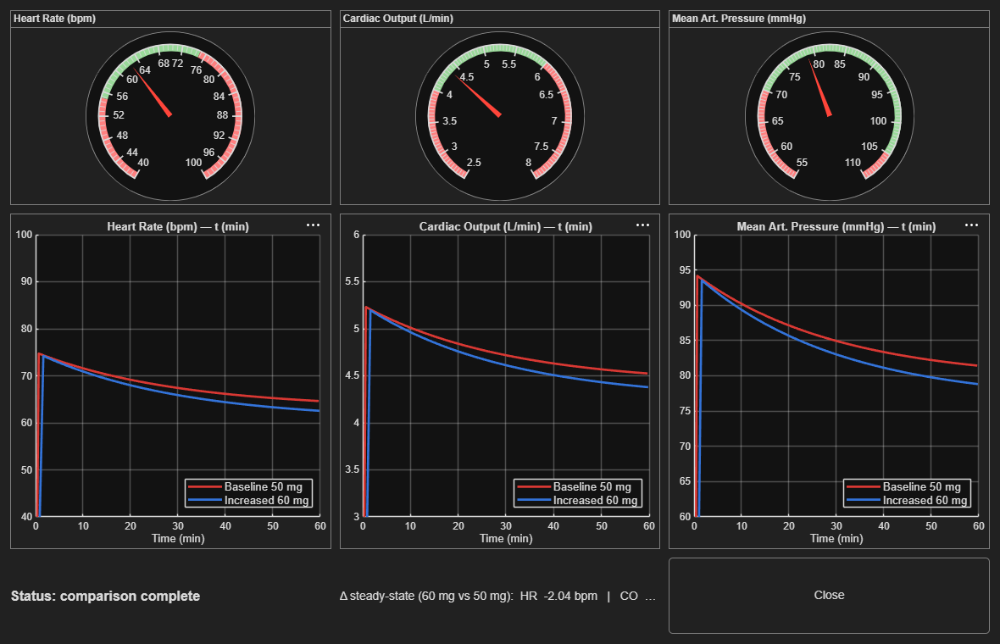

# Real-time dashboard

File: [`demo/realtime_dashboard.m`](https://github.com/samueltauil/cardiac-digital-twin/blob/main/demo/realtime_dashboard.m).

A `uifigure`-based dashboard that runs the 50 mg baseline and 60 mg modified dose back-to-back with **Simulink Pacing** enabled so the model plays out in near real time, then overlays the two runs in a single comparison view.

This is Prompt 8 in the demo sequence: the visualisation closer that turns the numerical comparison from Prompt 4 into something a non-engineer can absorb at a glance.



*Final dashboard state after both runs complete. Gauges show the live 60 mg values (HR 60.7, CO 4.24, MAP 76.5). The time-history axes overlay the two runs: red is 50 mg baseline, blue is 60 mg modified. The delta strip at the bottom shows the steady-state difference.*

---

## Layout

```
+----------------------------------------------------+
|   [HR gauge]    [CO gauge]    [MAP gauge]          |   <-- live current values
|                                                    |
|   [HR axes]     [CO axes]     [MAP axes]           |   <-- both runs overlaid
|                                                    |
|   Status: ...                                      |
|   Δ steady-state (60 vs 50): HR ... CO ... MAP ... |
|   [Close]                                          |
+----------------------------------------------------+
```

| Component | Role |
|---|---|
| Three `uigauge` widgets | Current HR, CO, MAP. Re-coloured per run so you see the *now*-value. |
| Three `uiaxes` with `animatedline` | Time history. Run 1 drawn in red, run 2 drawn in blue, both retained for comparison. |
| Status label | Tells the viewer which run is currently executing. |
| Δ readout | After both runs complete, shows the steady-state delta on all three outputs. |

---

## How the live update works

The dashboard does **not** simulate in batch and replay. It uses the live simulation engine and polls the running model:

```matlab
set_param(mdl, 'EnablePacing', 'on', 'PacingRate', '200', 'StopTime', '3600');
set_param(mdl, 'ReturnWorkspaceOutputs', 'off');

HR_block  = [mdl '/HeartRateModel/HRClamp'];      % leaf Saturation block
CO_block  = [mdl '/CardiacOutputModel/mLtoL'];    % leaf Gain block
MAP_block = [mdl '/BloodPressureModel/SVRGain'];  % leaf Gain block

set_param(mdl, 'SimulationCommand', 'start');

while ~strcmp(get_param(mdl, 'SimulationStatus'), 'stopped')
    rto_hr  = get_param(HR_block,  'RuntimeObject');
    rto_co  = get_param(CO_block,  'RuntimeObject');
    rto_map = get_param(MAP_block, 'RuntimeObject');
    tNow    = get_param(mdl, 'SimulationTime');

    if ~isempty(rto_hr) && tNow > lastT
        hr  = rto_hr.OutputPort(1).Data;
        co  = rto_co.OutputPort(1).Data;
        map = rto_map.OutputPort(1).Data;
        g_hr.Value  = hr;
        g_co.Value  = co;
        g_map.Value = map;
        addpoints(ln_hr,  tNow/60, hr);
        addpoints(ln_co,  tNow/60, co);
        addpoints(ln_map, tNow/60, map);
        drawnow limitrate;
        lastT = tNow;
    end
    pause(0.02);
end
```

Three pieces of Simulink machinery do the heavy lifting.

### Simulink Pacing: `EnablePacing` plus `PacingRate`

The user-facing `paceRate` argument is *wall-clock seconds per simulation second* (lower means faster). The dashboard converts it to Simulink's native `PacingRate` parameter (*simulation seconds per wall-clock second*) by taking the reciprocal. So `paceRate = 0.005` sets `PacingRate = 200`. With `StopTime = 3600`, that gives about 18 s wall-clock per run, about 36 s total. Fast enough to keep the demo moving, slow enough to *see* the exponential approach to steady state.

You can pass a different rate when calling the function:

```matlab
realtime_dashboard           % default 0.005 (~18 s/run)
realtime_dashboard(0.001)    % faster (~4 s/run)
realtime_dashboard(0.01)     % slower (~36 s/run)
```

### `RuntimeObject`. Reading signals from a running model

`get_param(blockPath, 'RuntimeObject')` returns a handle to the block's runtime state during a Normal-mode simulation. `rto.OutputPort(1).Data` is the current value at the block's first output port, updated at every major time step of the solver.

Reading these in a polling loop, gated on `tNow > lastT` so we only update on new time steps, gives smooth live values without contention.

### Polling leaf blocks, not virtual subsystems

The four top-level subsystems (`BetaBlockerPK`, `HeartRateModel`, `CardiacOutputModel`, `BloodPressureModel`) are **virtual subsystems**. Virtual subsystems are graphical groupings only: at compile time, Simulink inlines their contents into the parent's execution context. They have no runtime of their own and `get_param(virtualSubsystem, 'RuntimeObject')` returns empty during a run.

The fix is to poll the **leaf blocks inside** each subsystem instead:

| Signal | Subsystem | Leaf block polled | Block type |
|---|---|---|---|
| HR  | `HeartRateModel`       | `HRClamp`  | Saturation |
| CO  | `CardiacOutputModel`   | `mLtoL`    | Gain |
| MAP | `BloodPressureModel`   | `SVRGain`  | Gain |

Each is the last block in its subsystem, so its `OutputPort(1).Data` is the subsystem's output signal. The dashboard typically captures 120 to 150 live frames per 18 s run.

---

## Why this design

| Choice | Why |
|---|---|
| Use Simulink Pacing rather than `pause()` in a script loop | Pacing is solver-aware. The model itself slows down so the *physics* plays out at the chosen rate, not just the visualisation. |
| Use `RuntimeObject` rather than `To Workspace` logging | `To Workspace` data is only available *after* `sim()` returns. `RuntimeObject` is live. |
| Poll leaf blocks rather than the four top-level subsystems | Virtual subsystems get inlined at compile time and have no live runtime. The leaf Saturation/Gain blocks at the bottom of each subsystem do. |
| Flip `ReturnWorkspaceOutputs` to `off` during the run | With the default `on`, asynchronous `SimulationCommand='start'` writes results into a `SimulationOutput` object rather than directly to `tout`/`HR_out`/etc., breaking the post-run steady-state read. |
| Use `animatedline` rather than `plot` plus `XData` updates | `animatedline` was built for this. It is GPU-friendly, append-only, and `addpoints` is amortised. |
| Run both doses in the **same axes** | Overlay is the comparison. Two side-by-side panels would force the viewer to mentally subtract two curves. |
| Read the final values from base workspace after each run | After pacing finishes, the `To Workspace` blocks (`HR_out`, `CO_out`, `MAP_out`) have the full time series. That is where the steady-state Δ comes from. |
| `onCleanup` to restore pacing, StopTime, and dose | The dashboard is non-destructive. Calling it leaves the model in the same state it found it. |

---

## What the viewer sees

1. **Setup pause (about 1 s).** Dashboard window opens. Gauges sit at zero.
2. **Run 1, 50 mg baseline (about 18 s).** Status reads *"running Baseline 50 mg"*. Gauges climb to about 63 bpm, 4.4 L/min, 79 mmHg. Red traces accumulate on the time-history axes.
3. **Brief transition (about 1 s).** Status updates to *"running Increased 60 mg"*.
4. **Run 2, 60 mg modified (about 18 s).** Blue traces draw on the *same* axes as run 1. Gauges land slightly lower than the first run.
5. **Final view.** Both traces visible. Δ readout populates at the bottom:

    ```
    Δ steady-state (60 mg vs 50 mg):
      HR -2.38 bpm  |  CO -0.167 L/min  |  MAP -3.00 mmHg
    ```

---

## When to use the dashboard in the demo

The dashboard is **Prompt 8**, the *optional visual closer*. The demo is already complete after Prompt 7 (you have model, sim, interpretation, test, requirements). The dashboard adds:

- A real-time visual that anchors the story.
- A clear *"this is the same model, with the same prompts, but now you are watching the physiology evolve"* moment.
- A natural Q&A trigger for the audience.

Skip it if the demo is running short on time. Run it if you have at least 90 seconds of headroom; pacing makes the whole thing roughly 40 seconds, plus narration.

---

## Extending it

A few directions the dashboard could grow.

Sensitivity sliders: a live `uislider` on `beta_hr_sensitivity` that updates the model parameter mid-run and shows the effect.

Patient-profile selector: a dropdown that swaps in different sets of parameters (elderly, heart-failure, athlete) and reruns.

CSV export: a "Save run" button that writes both runs to disk for inclusion in a clinical review.

Multi-dose sweep: replace the two fixed doses with a parameter sweep and render a dose-response curve as it builds.

All of these are local edits to `realtime_dashboard.m`. None require touching the model.

---

## Troubleshooting

| Symptom | Likely cause | Fix |
|---|---|---|
| Gauges never move, console reports `0 live frames` | Polling a virtual subsystem instead of a leaf block. | Use the leaf block paths (`HRClamp`, `mLtoL`, `SVRGain`), not the parent subsystem names. |
| `tout`/`HR_out`/etc. missing after the run | `ReturnWorkspaceOutputs` is `on`, so results landed in a `SimulationOutput` object. | The dashboard already flips this to `off` and restores it via `onCleanup`. If you start the model manually, set it yourself. |
| Loop exits immediately after `SimulationCommand='start'` | `start` is asynchronous; the status was still `'stopped'` when the loop checked. | The dashboard spins on `SimulationStatus == 'stopped'` for up to 5 s before entering the polling loop. |
| Window closes before run 2 finishes | User clicked `Close`. | The dashboard checks the figure handle before drawing; closing aborts cleanly and stops the simulation. |
| Pacing too slow or too fast | `paceRate` mismatch with audience speed. | Call `realtime_dashboard(0.002)` for faster, `realtime_dashboard(0.01)` for slower. |
| Final Δ readout shows zeros | Sim was stopped before completion. | `To Workspace` blocks only populate after the run ends. Re-run without interrupting. |
