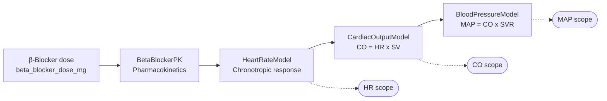

# Cardiac Digital Twin

**A model-based AI engineering demo driven by GitHub Copilot and the Simulink Agentic Toolkit.**

This documentation is the companion to the live demo. It explains what the model is, how each formula was chosen, why the engineering choices were made the way they were, and how **GitHub Copilot turns a clinical question into a verified engineering artifact** in a handful of natural-language prompts.

---

## What it is

A four-stage Simulink model of an adult patient's haemodynamic response to oral metoprolol, a beta-blocker.



Each subsystem is calibrated against published clinical data so the steady-state behaviour is physiologically plausible.

| Output at 50 mg metoprolol succinate | Model value | Clinical reference |
|---|:---:|:---:|
| Heart rate | 63 bpm | 60 to 65 bpm |
| Cardiac output | 4.4 L/min | 4 to 5 L/min |
| Mean arterial pressure | 79 mmHg | 75 to 85 mmHg |

---

## Why GitHub Copilot matters here

A digital twin is only useful if a non-engineer can ask it questions. The hard part is the *translation*: the cardiologist's clinical question on one side, the engineering artifact that answers it on the other.

That is exactly where Copilot, augmented by the Simulink Agentic Toolkit's MCP server, earns its keep.

<div class="grid cards" markdown>

-   :material-stethoscope:{ .lg .middle } **From clinical intent to model action**

    ---

    *"Increase the patient's metoprolol by 20 percent."* becomes a typed
    `model_edit` operation on the right parameter, discovered, resolved, and
    applied without the user touching MATLAB.

-   :material-eye-outline:{ .lg .middle } **From model to explanation**

    ---

    Copilot reads the model graph through `model_overview` and `model_read` and
    explains it in clinical terms, translating block topology back into
    physiology a cardiologist can review.

-   :material-flask-outline:{ .lg .middle } **From simulation to interpretation**

    ---

    A `sim()` run is automatically followed by a steady-state comparison, a
    clinical safety check, and a flag list for the cardiologist's attention.

-   :material-shield-check-outline:{ .lg .middle } **From decision to traceability**

    ---

    The same prompt chain that *changed the dose* also produces the Gherkin
    test, the formal engineering requirements, and the link set tying both
    back to the affected subsystems.

</div>

---

## How to read this site

| Page | When to read it |
|---|---|
| [The Copilot workflow](copilot-workflow.md) | You want to see the full prompt-by-prompt narrative, the core of the demo. |
| [Model architecture](architecture.md) | You want to know what each Simulink subsystem does and how they connect. |
| [Physiology and math](physiology.md) | You want the formulas, calibration choices, and clinical rationale. |
| [Validation](validation.md) | You want the Gherkin test and the verification methodology. |
| [Requirements](requirements.md) | You want the formal engineering requirements (.slreqx) and traceability links. |
| [Real-time dashboard](dashboard.md) | You want the live `uifigure` dashboard and pacing details. |
| [Reference](reference.md) | Parameter values, MCP tools, file map. |

---

## Quick start

```bash
# 1. Install the Simulink Agentic Toolkit in MATLAB (one-time).
#    See setup/mcp-configuration.md.

# 2. From MATLAB, in the repo root:
run('setup/startup.m')

# 3. Reload VS Code so Copilot's MCP client attaches.

# 4. In Copilot Chat (Agent mode):
#    "Describe the structure of the currently open Simulink model."
```

If Copilot calls `model_overview` and returns a description, you are ready to run the full demo from [`demo/live_prompts.md`](https://github.com/samueltauil/cardiac-digital-twin/blob/main/demo/live_prompts.md).

---

## Repository layout

```
cardiac-digital-twin/
├── .github/
│   ├── copilot-instructions.md     Repo-wide context loaded into every Copilot turn
│   ├── agents/cardiac-demo.agent.md Custom agent definition
│   └── prompts/                    Eight reusable Copilot prompts (steps 1 to 8)
├── docs/                           You are here (MkDocs source)
├── model/
│   ├── cardiac_params.m            Workspace parameters
│   └── create_cardiac_model.m      Builds CardiacDigitalTwin.slx programmatically
├── validation/
│   ├── beta_blocker_dose_response.feature   Gherkin verification test
│   └── validate_beta_blocker.m              MATLAB validation suite
├── demo/
│   ├── live_prompts.md             Eight-step Copilot walkthrough
│   ├── narrative_script.md         Executive narration track
│   ├── scripted_runbook.md         Pre-verified fallback outputs
│   └── realtime_dashboard.m        Live uifigure dashboard
├── CardiacDigitalTwin_Requirements.slreqx  Formal engineering requirements
└── setup/                          Startup script and MCP configuration guide
```

---

!!! info "About the demo's scope"

    This model is a teaching artifact, not a regulated medical device. The v1
    model uses a deliberately simple linear-PK and linear-gain structure so
    the relationship between every parameter and every clinical outcome is
    immediately auditable; that is the right shape for the 7-prompt live
    demo.

    Phase 2 closes the three biggest gaps in v1, each via one additional
    Copilot prompt and one analysis script. The advanced model lives in
    [`CardiacDigitalTwin_v2.slx`](https://github.com/samueltauil/cardiac-digital-twin/blob/main/model/CardiacDigitalTwin_v2.slx)
    and is documented in [Advanced physiology (Phase 2)](advanced-physiology.md):

    - Nonlinear receptor binding via a Hill/Emax equation (Prompt 9).
    - Closed-loop baroreflex feedback from MAP back to HR (Prompt 10).
    - Monte Carlo virtual patient cohort with PRCC sensitivity tornado (Prompt 11).

    The v1 model still drives the original 7-prompt demo; v2 is the
    optional deep dive.
