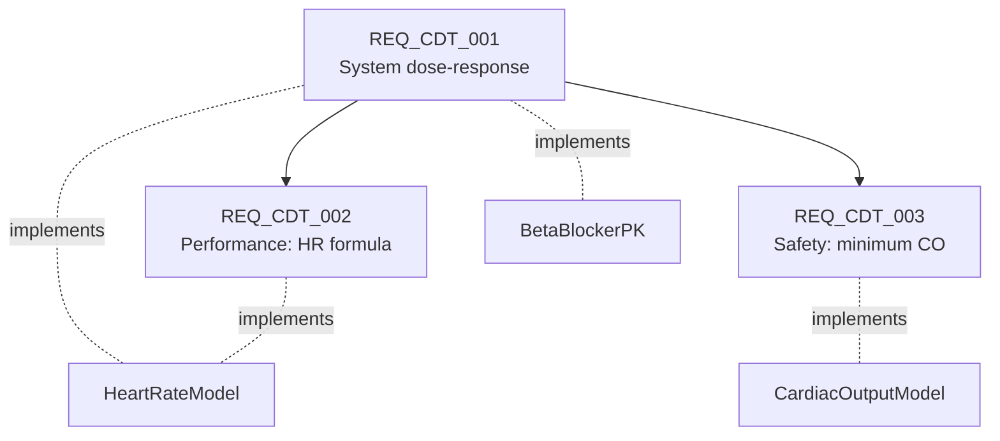

# Requirements

A digital twin without requirements is a simulator. A digital twin *with* requirements, and with traceability from each requirement to the model element that implements it, is an **engineering artifact**.

This page documents the three requirements Copilot drafts in Prompt 7, and explains why each one is shaped the way it is.

---

## The artifact

File: [`CardiacDigitalTwin_Requirements.slreqx`](https://github.com/samueltauil/cardiac-digital-twin/blob/main/CardiacDigitalTwin_Requirements.slreqx).

Created via Requirements Toolbox (`slreq.new`, `slreq.add`, `slreq.createLink`). Three top-level requirements with parent and child relationships.



All three are marked `draft` and `auto-generated` in their keyword set. They are the *starting point* for a human reviewer, not the finished article.

---

## REQ_CDT_001. System dose-response

!!! abstract "EARS pattern: Event-driven"
    **When** the prescribed beta-blocker dose (`beta_blocker_dose_mg`) increases
    from 50 mg to 60 mg, the cardiac digital twin **shall** reduce the
    steady-state heart rate by at least 0.5 bpm.

**Rationale.** The digital twin produces a clinically directionally-correct chronotropic response to dose escalation, supporting its use as a decision-support tool for cardiologist titration review. The threshold is deliberately modest (0.5 bpm): because the Hill curve is already past its EC50 at 50 mg, the marginal effect of a further 20 % dose increase is small — a closed-loop drop of about 0.85 bpm — and the requirement must reflect that saturating reality rather than a linear extrapolation.

**Trace links** (`Implement`):

- `CardiacDigitalTwin:2` (`BetaBlockerPK`). PK stage that produces the steady-state plasma concentration.
- `CardiacDigitalTwin:3` (`HeartRateModel`). Chronotropic stage that converts concentration into HR reduction.

**Verification.** [`validation/beta_blocker_dose_response.feature`](https://github.com/samueltauil/cardiac-digital-twin/blob/main/validation/beta_blocker_dose_response.feature), passing (2 open-loop Hill scenarios, 5 of 5 assertions).

**Why event-driven EARS?** The requirement is *conditional on an event* (a dose change). Ubiquitous wording (*"the system shall reduce HR…"*) would read as if it were always reducing HR; event-driven framing makes the trigger explicit.

---

## REQ_CDT_002. Performance: HR formula

!!! abstract "EARS pattern: Ubiquitous"
    At steady state, the cardiac digital twin **shall** compute the drug-induced
    heart-rate reduction as a Hill/Emax function of plasma concentration —
    `emax_bpm` (18 bpm) times `C^hill_n` over `ec50_mg^hill_n + C^hill_n`, with
    `hill_n` = 1.5 and `ec50_mg` = 35 mg — within \(\pm 0.5\) bpm tolerance, for
    any dose in the range `[0 mg, 145 mg]`.

**Rationale.** Pins the model's chronotropic response to a calibrated, clinically plausible saturating curve. The Hill form captures receptor-binding saturation, so the marginal effect of dose escalation shrinks as the dose rises — the central behaviour the demo demonstrates.

**Trace links:**

- `CardiacDigitalTwin:3` (`HeartRateModel`). The subsystem that implements the formula.

**Why \(\pm 0.5\) bpm?** The simulation's first-order PK takes about 5\(\tau\) (9000 s) to settle to within 0.7 % of the asymptote. The 0.5 bpm tolerance covers both solver settling and any small numerical drift, while still being tight enough to detect a real calibration error.

**Why the [0, 145] mg ceiling?** The HR saturation clamp (floor 40 bpm) marks the edge of the model's validity domain. At therapeutic doses the Hill drug effect alone removes at most ~15 bpm, so the clamp never engages; the bound documents the dose beyond which the model is no longer claimed representative.

**Why ubiquitous EARS?** This is an always-true property of the model, not a response to a trigger. Ubiquitous framing communicates "invariant" better than event-driven framing would.

---

## REQ_CDT_003. Safety: minimum cardiac output

!!! abstract "EARS pattern: Unwanted-behaviour"
    **If** the prescribed dose lies within the therapeutic range
    `[0 mg, 100 mg]`, **then** the cardiac digital twin **shall** maintain
    steady-state cardiac output at or above 4.0 L/min.

**Rationale.** The digital twin flags any dosing recommendation that would push the simulated patient below the clinical perfusion threshold, preventing the tool from endorsing a haemodynamically unsafe titration.

**Trace links:**

- `CardiacDigitalTwin:4` (`CardiacOutputModel`). The subsystem whose output the requirement constrains.

**Why 4.0 L/min?** It corresponds to a cardiac index of about 2.0 L/min/m\(^2\) for a typical adult (BSA about 2.0 m\(^2\)), the conventional lower bound of adequate resting perfusion. Below this, organ delivery starts to be compromised.

**Why unwanted-behaviour EARS?** Safety constraints map naturally to *"if condition, then response"* phrasing. It is the canonical pattern for expressing a guard.

### How the saturating model satisfies it

REQ_CDT_003 holds across the entire therapeutic range, and the Hill saturation is what makes that true. Because the drug effect plateaus near `emax_bpm`, heart rate never collapses the way a constant-gain model would:

\[
\begin{aligned}
\text{HR}_{100\text{mg}}^{\text{open-loop}} &= 75 - 18\cdot\frac{100^{1.5}}{35^{1.5}+100^{1.5}} \approx 60.1\ \text{bpm} \\
\text{CO}_{100\text{mg}}^{\text{open-loop}} &= 60.1 \cdot 70 / 1000 \approx 4.21\ \text{L/min}
\end{aligned}
\]

4.21 L/min is above the 4.0 floor even with the baroreflex switched off, and the closed-loop value is higher still (~4.6 L/min) because the reflex restores part of the heart-rate drop. A naive linear gain would have pushed CO below 4.0 well inside the therapeutic range; the receptor-saturation physics is precisely what supplies the safety margin.

This is the kind of property a cardiologist review can lean on: the safety floor is not an arbitrary guard bolted on top, it falls out of the pharmacodynamics. The requirement is traced to verification so the margin is checked on every run rather than assumed.

---

## The link set

```
Source                                Type        Destination
─────────────────────────────────── ────────── ──────────────
CardiacDigitalTwin:2 (BetaBlockerPK)  Implement   REQ_CDT_001
CardiacDigitalTwin:3 (HeartRateModel) Implement   REQ_CDT_001
CardiacDigitalTwin:3 (HeartRateModel) Implement   REQ_CDT_002
CardiacDigitalTwin:4 (CardiacOutputModel) Implement   REQ_CDT_003
```

Direction is intentionally **model element to requirement**. This is the Requirements Toolbox convention: the implementer points at what it implements.

When you open the requirement set in MATLAB:

```matlab
slreq.open('CardiacDigitalTwin_Requirements')
```

…each requirement shows up in the Requirements Editor with an `Implements` arrow rendered alongside the source block in the Simulink canvas.

---

## What Copilot does differently from a template generator

A boilerplate template generator would produce phrasing like *"the system shall not exceed 180 bpm"*. Copilot's draft is structurally different.

Numeric values are typed with their workspace variables. Instead of bare numbers, requirements reference *`emax_bpm` (18 bpm)* and *`ec50_mg` (35 mg)*. That makes the requirement legible *and* makes it survive a future re-calibration without becoming stale.

Validity domains are explicit. REQ_CDT_002 bounds the dose range to [0, 145] mg, derived from where the saturation clamp activates. A template wouldn't compute that derivation.

Physical margins are traced to their cause, not asserted. REQ_CDT_003's Description explains *why* cardiac output stays above 4.0 L/min across the therapeutic range — the Hill saturation plateaus the drug effect near `emax_bpm`, so CO bottoms out at ~4.21 L/min open-loop (higher closed-loop) rather than collapsing the way a constant-gain model would. The safety margin falls out of the pharmacodynamics instead of being asserted as a bare number.

The result is a requirement set a human reviewer can engage with: challenge the bounds, refine the rationale, baseline the wording. Not a plausible-looking artifact that is actually empty.

---

## Promoting drafts to baselined requirements

The `draft` keyword on every requirement is a checkpoint. The recommended workflow:

1. Review each requirement in the Requirements Editor.
2. Adjust wording, tolerances, and trace links as needed.
3. Verify the trace links by opening each subsystem and confirming the *Requirements* badge appears.
4. Remove the `draft` keyword.
5. Save and tag the `.slreqx` file with the model version it was baselined against.

After baselining, requirement IDs are *frozen*. Future Copilot prompts add new IDs (`REQ_CDT_004` and onward). They never renumber or overwrite an existing baseline.
