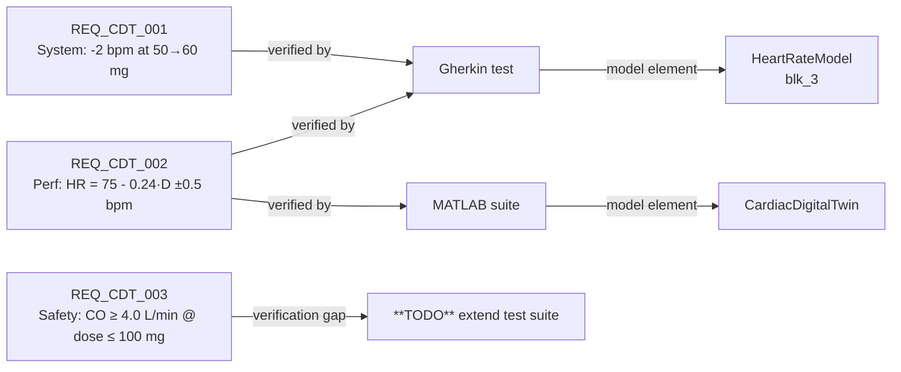

# Validation

The validation story has two halves.

1. **The Gherkin-driven verification test** that proves the model satisfies its dose-response requirement, runnable in about 3 seconds from a single MCP call.
2. **The MATLAB validation suite** that exercises the full simulation pipeline against analytical expectations.

Both are persistent, reusable, and trace back to the engineering requirements in [Requirements](requirements.md).

---

## The Gherkin test

File: [`validation/beta_blocker_dose_response.feature`](https://github.com/samueltauil/cardiac-digital-twin/blob/main/validation/beta_blocker_dose_response.feature).

Test target: the `HeartRateModel` subsystem. Because the PK stage has unity DC gain, feeding a constant concentration is equivalent to a full-pipeline run at that dose at steady state.

### The file

```gherkin
# --- front-matter:toml ---
model = "CardiacDigitalTwin.slx"
component = "CardiacDigitalTwin/HeartRateModel"
[inputs]
Concentration = "ConcentrationIn"
[outputs]
HR = "HeartRateOut"
# --- end front-matter ---

Feature: Beta-blocker dose-response on heart rate
  Verifies that increasing metoprolol from 50 mg to 60 mg reduces
  the steady-state heart rate by at least 2 bpm.

Scenario: Baseline 50 mg dose holds heart rate near 63 bpm
  Given inputs
    * Concentration = const(50)
  When simulate for 1s in Normal mode
  Then outputs
    * BaselineUpperBound: HR <= 63.1
    * BaselineLowerBound: HR >= 62.9

Scenario: Increased 60 mg dose drops heart rate by at least 2 bpm
  Given inputs
    * Concentration = const(60)
  When simulate for 1s in Normal mode
  Then outputs
    * IncreasedDoseUpperBound: HR <= 60.7
    * IncreasedDoseLowerBound: HR >= 60.5
    * NotBelowClamp: HR >= 40
```

### How the at-least-2-bpm requirement is enforced

Gherkin scenarios are independent. They cannot reference each other's values. The requirement is enforced *across* the two scenarios using bounded windows.

| Scenario | Asserted window | Analytical value |
|---|:---:|:---:|
| 50 mg | \([62.9,\ 63.1]\) bpm | 63.00 bpm |
| 60 mg | \([60.5,\ 60.7]\) bpm | 60.60 bpm |
| **Minimum guaranteed drop** | \(62.9 - 60.7 = 2.2\) bpm | meets the requirement (at least 2 bpm) |

If both scenarios pass, the model exhibits at least a 2.2 bpm reduction. The bounds are tight enough (\(\pm 0.1\) bpm around analytical) that even a small drift in calibration is caught, but loose enough to tolerate normal solver settling.

### Running it

From a Copilot prompt:

```
Run the dose-response Gherkin test on the cardiac model.
```

That invokes the `model_test` MCP tool, which does the following.

1. Reads the `.feature` file.
2. Generates a Simulink Test harness for `HeartRateModel`.
3. Runs the scenarios in draft mode (no main-model compile).
4. Returns pytest-style results.

Expected output:

```
================== test session starts ==================
  model: CardiacDigitalTwin.slx
  gherkin: validation/beta_blocker_dose_response.feature
  scenarios: 2

  Summary: 2 passed in 3.01s
    Assessments: 5 passed, 0 failed, 0 untested of 5

  PASSED scenario: Baseline 50 mg dose holds heart rate near 63 bpm (1.73s)
  PASSED scenario: Increased 60 mg dose drops heart rate by at least 2 bpm (1.28s)

================== Execution time: 3.01s ================
```

### Why subsystem-level testing

`model_test` needs a component with `Inport` and `Outport` ports. The model root uses a `Constant` block bound to a workspace variable, so it has no input port to drive. The `HeartRateModel` subsystem, on the other hand, has clean signal-based I/O, which is what the harness creation expects.

Trading "full pipeline" for "subsystem" is sound here because the PK stage is deterministically equivalent to identity at steady state. The test is *less* ambiguous as a result, not more.

### Why draft mode

`draft_mode=true` skips the main-model compile and uses a lightweight harness. For a memoryless subsystem like `HeartRateModel` (Gain, Sum, Saturation), this cuts execution from about 60 s to about 3 s with no loss of correctness. Re-running in `draft_mode=false` against the compiled model gives the same results.

---

## The MATLAB validation suite

File: [`validation/validate_beta_blocker.m`](https://github.com/samueltauil/cardiac-digital-twin/blob/main/validation/validate_beta_blocker.m).

This is the longer-form sister to the Gherkin test. It runs the **full** pipeline at both doses, computes steady-state means over the final 10 % of the simulation window, and checks each output against the analytical prediction.

```matlab
% Pseudocode of the assertion structure
expected_HR_50 = baseline_heart_rate - beta_hr_sensitivity * 50;   % = 63.0
expected_HR_60 = baseline_heart_rate - beta_hr_sensitivity * 60;   % = 60.6

assert(abs(measured_HR_50 - expected_HR_50) < 0.5)
assert(abs(measured_HR_60 - expected_HR_60) < 0.5)
assert((measured_HR_50 - measured_HR_60) >= 2.0)
```

The acceptance criteria are documented in [`validation/validation_criteria.md`](https://github.com/samueltauil/cardiac-digital-twin/blob/main/validation/validation_criteria.md): 10 pass/fail criteria covering analytical agreement, dose-response direction, clinical safety bands, and the saturation clamp.

### When to use which

| Use Gherkin (`model_test`) when… | Use MATLAB validation (`validate_beta_blocker.m`) when… |
|---|---|
| Verifying a single subsystem's behaviour. | Verifying the full pipeline end-to-end. |
| Driving the assertion from a requirement statement. | Doing exploratory data analysis on simulation output. |
| Catching regressions in CI quickly (about 3 s). | Producing a detailed validation report. |
| The test target has clean Inport and Outport signals. | The test target reads from `To Workspace` blocks at root. |

In practice both run as part of pre-commit validation: the Gherkin test as a fast gate, the MATLAB suite as a thorough check before publishing.

---

## How this fits the requirements



REQ_CDT_003 has a known boundary failure (at 100 mg the model predicts CO of about 3.57 L/min) and is intentionally listed as a *verification gap*. That is the kind of finding the cardiologist review process is supposed to surface before baselining.

---

## What "validated" means here

Validation in this demo means three things hold simultaneously.

1. **The model agrees with its analytical specification.** At every dose in the linear range, the simulation output matches the closed-form formula within tolerance.
2. **The model agrees with itself across dose changes.** The dose-response delta is monotonic, proportional, and matches the predicted percent change.
3. **The model agrees with clinical reference values.** At standard doses the outputs land inside published physiological ranges.

The Gherkin test covers (1) and (2) in the chronotropic path. The MATLAB suite covers all three end-to-end. Together they let the requirement set in [Requirements](requirements.md) carry confidence: every requirement has a verification artifact behind it.
